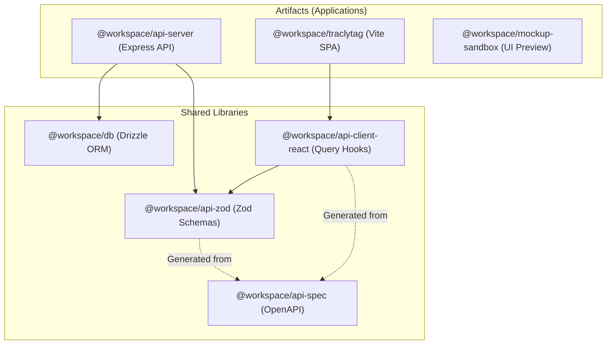
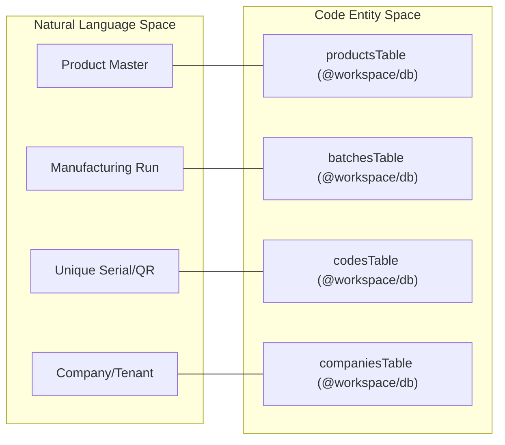

# TraclyTag Overview

Relevant source files

The following files were used as context for generating this wiki page:

- [artifacts/api-server/package.json](artifacts/api-server/package.json)
- [artifacts/api-server/src/seed.ts](artifacts/api-server/src/seed.ts)
- [artifacts/api-server/traclytag.db](artifacts/api-server/traclytag.db)
- [artifacts/api-server/vercel.json](artifacts/api-server/vercel.json)
- [artifacts/traclytag/vercel.json](artifacts/traclytag/vercel.json)
- [package.json](package.json)
- [start.txt](start.txt)

TraclyTag is a comprehensive supply chain traceability and serialization platform designed to implement **GS1 standards** for product verification and tracking. It provides a multi-tenant environment where companies can manage product masters, generate serialized codes (GTIN, SSCC), track manufacturing batches, and monitor the movement of goods through various supply chain nodes.

The system is built as a modern TypeScript monorepo, utilizing a shared API contract to ensure type safety across a React-based Single Page Application (SPA) and an Express-based API server.

## System Architecture

TraclyTag utilizes a monorepo structure managed by `pnpm` workspaces. This architecture allows shared libraries (like database schemas and API definitions) to be consumed by both the frontend and backend without duplication.

### High-Level Subsystems Diagram

This diagram illustrates the relationship between the core software artifacts and the shared libraries that bind them.

**Diagram: TraclyTag Subsystem Relationships**

Sources: [package.json:1-12](), [artifacts/api-server/package.json:15-18](), [artifacts/traclytag/vercel.json:1-17]()

## Key Use Cases

1.  **GS1 Serialization**: Generation of unique unit codes incorporating GTIN, Expiry, Batch, and Serial Numbers, as well as SSCC (Serial Shipping Container Codes) for pallets and shippers [artifacts/api-server/src/seed.ts:180-231]().
2.  **Supply Chain Traceability**: Mapping generated codes to specific locations (Warehouses, Distributors, Retailers) to create a digital pedigree of the product [artifacts/api-server/src/seed.ts:67-103](), [artifacts/api-server/src/seed.ts:236-249]().
3.  **Product Verification**: A public-facing mechanism to verify the authenticity of a product by scanning its GS1 DataMatrix and looking up its status in the `codes` table [artifacts/api-server/traclytag.db:22-40]().
4.  **Multi-Tenant Management**: Support for multiple companies, each with their own users, products, and locations, isolated via `company_id` foreign keys [artifacts/api-server/traclytag.db:2-21]().

## Code Entity Mapping

The following diagram bridges the natural language concepts of the supply chain to the specific database entities and API structures used in the code.

**Diagram: Domain Concept to Code Entity Mapping**

Sources: [artifacts/api-server/src/seed.ts:2-10](), [artifacts/api-server/traclytag.db:2-92]()

## Child Sections

### [Repository Structure and Monorepo Setup](#1.1)
Details the pnpm workspace layout, including the `artifacts/` directory for deployable apps and `lib/` for shared packages. It covers the build pipeline and dependency management between internal packages like `@workspace/db` and `@workspace/api-zod`.
*For details, see [Repository Structure and Monorepo Setup](#1.1).*

### [Deployment Architecture](#1.2)
Explains the dual-project deployment on Vercel. It describes how `artifacts/traclytag` (frontend) and `artifacts/api-server` (backend) interact through Vercel's rewrite engine to bypass CORS issues and provide a unified URL structure.
*For details, see [Deployment Architecture](#1.2).*

Sources: [artifacts/traclytag/vercel.json:1-17](), [artifacts/api-server/vercel.json:1-9](), [package.json:6-11]()

---
