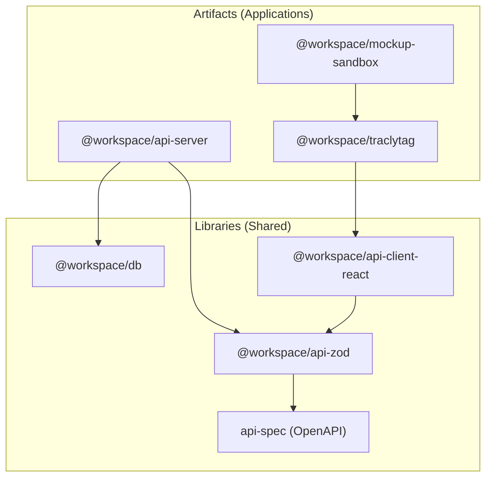
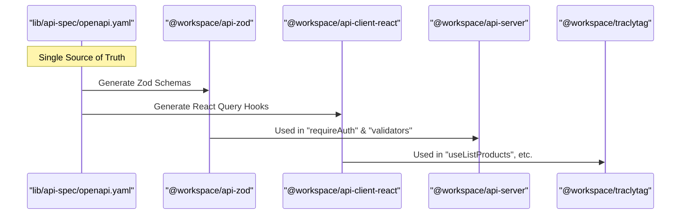

# Repository Structure and Monorepo Setup

Relevant source files

The following files were used as context for generating this wiki page:

- [artifacts/api-server/package.json](artifacts/api-server/package.json)
- [artifacts/api-server/tsconfig.json](artifacts/api-server/tsconfig.json)
- [artifacts/api-server/vercel.json](artifacts/api-server/vercel.json)
- [artifacts/traclytag/vite.config.ts](artifacts/traclytag/vite.config.ts)
- [package.json](package.json)
- [pnpm-lock.yaml](pnpm-lock.yaml)

This page details the technical organization of the TraclyTag codebase, which is managed as a monorepo using **pnpm workspaces**. The structure is designed to enforce a strict separation between deployable applications (artifacts), shared business logic (libraries), and development tooling (scripts).

## Monorepo Layout

The repository is partitioned into three primary top-level directories: `artifacts/`, `lib/`, and `scripts/`. This separation ensures that shared code is versioned and managed independently of the specific deployment targets.

### Directory Overview

| Directory | Purpose | Key Contents |
| :--- | :--- | :--- |
| `artifacts/` | Deployable applications and services. | `api-server`, `traclytag`, `mockup-sandbox` |
| `lib/` | Shared libraries, types, and database logic. | `api-client-react`, `api-spec`, `api-zod`, `db`, `gs1.ts` |
| `scripts/` | Tooling for automation and code generation. | API client generation, post-merge hooks |

### Dependency Graph

The following diagram illustrates the internal dependency flow within the workspace.

**Workspace Dependency Relationships**

**Sources:** [package.json:1-18](), [artifacts/api-server/package.json:15-28](), [pnpm-lock.yaml:162-167]()

---

## Workspace Configuration

The monorepo is powered by `pnpm`, utilizing the `pnpm-workspace.yaml` (implied by `pnpm-lock.yaml` importers) to manage internal linking.

### Package Management
The root `package.json` enforces the use of `pnpm` via a `preinstall` script to prevent accidental usage of `npm` or `yarn` which would break workspace symlinking [package.json:7-7]().

### Build Pipeline
The build process is hierarchical:
1.  **Typechecking Libraries**: Shared libraries are checked first using `tsc --build` to ensure downstream artifacts have valid types [package.json:9-9]().
2.  **Recursive Build**: The command `pnpm -r --if-present run build` executes the specific build scripts defined in each package [package.json:8-8]().

**Sources:** [package.json:6-11]()

---

## Core Artifacts

### 1. API Server (`artifacts/api-server`)
The backend service built with Express. It depends on `@workspace/db` for data persistence and `@workspace/api-zod` for request validation [artifacts/api-server/package.json:17-18]().
-   **Build System**: Uses `esbuild` via a custom `build.mjs` script to bundle the TypeScript source into a production-ready ESM module [artifacts/api-server/package.json:11-11]().
-   **Vercel Integration**: Contains a `vercel.json` that rewrites all incoming requests to the entry point `api/index.js` for serverless deployment [artifacts/api-server/vercel.json:1-9]().

### 2. TraclyTag Frontend (`artifacts/traclytag`)
The primary React SPA built with Vite.
-   **Proxy Configuration**: In development, the Vite server proxies `/api` requests to `http://localhost:3000` to avoid CORS issues during local iteration [artifacts/traclytag/vite.config.ts:56-61]().
-   **Asset Aliasing**: Uses Vite aliases to reference shared assets located outside the package root in `attached_assets` [artifacts/traclytag/vite.config.ts:37-40]().

### 3. Mockup Sandbox (`artifacts/mockup-sandbox`)
A specialized Vite environment used for UI prototyping. It allows developers to build and test components in isolation before integrating them into the main `traclytag` application.

**Sources:** [artifacts/api-server/package.json:1-44](), [artifacts/api-server/vercel.json:1-9](), [artifacts/traclytag/vite.config.ts:1-68]()

---

## Shared Libraries (`lib/`)

The `lib/` directory contains the "Source of Truth" for the entire system's data structures and communication protocols.

### API Contract Flow
The API contract is managed through a code-generation pipeline that ensures frontend and backend are always in sync.

**API Contract Code Entities**

-   **`api-spec`**: Contains the OpenAPI 3.1 specification.
-   **`api-zod`**: Houses Zod schemas generated from the spec. These are used by the `api-server` to validate `req.body` and `req.query` [artifacts/api-server/package.json:17-17]().
-   **`api-client-react`**: Contains TanStack Query hooks generated from the spec, providing type-safe data fetching for the frontend.
-   **`db`**: Drizzle ORM schemas and migration files shared across the backend and seeding scripts [artifacts/api-server/package.json:18-18]().

**Sources:** [artifacts/api-server/tsconfig.json:10-17](), [artifacts/api-server/package.json:15-28]()

---

## Scripts and Automation

The `scripts/` directory handles cross-package concerns and maintenance.

### Post-Merge Automation
The repository utilizes scripts to maintain consistency after git operations (e.g., pulling new changes). This includes:
-   Re-running code generation if `api-spec` changes.
-   Ensuring `pnpm install` is executed if `pnpm-lock.yaml` is updated.

### TypeScript Orchestration
The root `tsconfig.json` and package-specific `tsconfig.json` files use Project References to enable incremental builds. For example, `api-server` references `lib/db` and `lib/api-zod`, allowing `tsc` to understand the dependency graph during typechecking [artifacts/api-server/tsconfig.json:10-17]().

**Sources:** [package.json:9-10](), [artifacts/api-server/tsconfig.json:1-18]()

---
