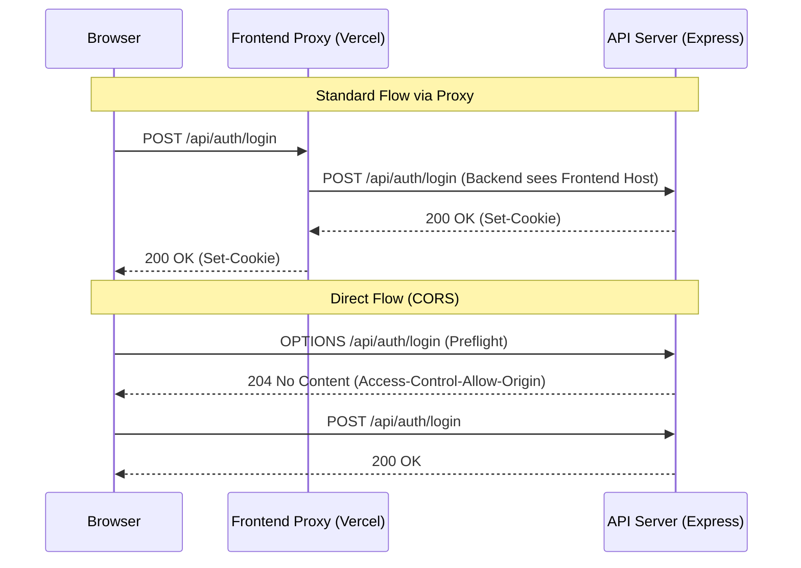

# Deployment Architecture

<details>
<summary>Relevant source files</summary>

The following files were used as context for generating this wiki page:

- [artifacts/api-server/api/index.js](artifacts/api-server/api/index.js)
- [artifacts/api-server/api/index.js.map](artifacts/api-server/api/index.js.map)
- [artifacts/api-server/package.json](artifacts/api-server/package.json)
- [artifacts/api-server/vercel.json](artifacts/api-server/vercel.json)
- [artifacts/traclytag/vercel.json](artifacts/traclytag/vercel.json)

</details>


The TraclyTag ecosystem is deployed as a decoupled architecture on **Vercel**, consisting of two primary projects: the React Single Page Application (SPA) and the Express-based API server. This separation allows for independent scaling and deployment cycles while maintaining a unified origin experience for the user through Vercel's edge routing and proxy capabilities.

## High-Level Deployment Overview

The frontend (`traclytag`) serves as the entry point for users. It manages client-side routing and UI state, while delegating all data persistence and business logic to the backend (`api-server`). To avoid Cross-Origin Resource Sharing (CORS) complexities in the browser, the frontend project acts as a reverse proxy, forwarding `/api/*` requests to the dedicated backend deployment.

### System Interaction Diagram

The following diagram illustrates the flow of a request from the user's browser through the Vercel edge network to the respective microservices.

**Vercel Request Flow**
```mermaid
graph TD
    subgraph "User Browser"
        [Browser] -- "GET /dashboard" --> [Vercel_Edge_Frontend]
        [Browser] -- "POST /api/auth/login" --> [Vercel_Edge_Frontend]
    end

    subgraph "Vercel Project: traclytag (Frontend)"
        [Vercel_Edge_Frontend] -- "SPA Catch-all" --> [index.html]
        [Vercel_Edge_Frontend] -- "Proxy /api/*" --> [Vercel_Edge_Backend]
    end

    subgraph "Vercel Project: api-server (Backend)"
        [Vercel_Edge_Backend] -- "Rewrite /(.*)" --> [api/index.js]
        [api/index.js] -- "Execute" --> [Express_App]
    end

    [Express_App] -- "SQL" --> [LibSQL_Database]
```
**Sources:** [artifacts/traclytag/vercel.json:1-17](), [artifacts/api-server/vercel.json:1-9]()

---

## Frontend Deployment (`traclytag`)

The frontend is a React SPA built with Vite. It is deployed to Vercel with a specific `vercel.json` configuration that handles two critical tasks: proxying API requests and enabling client-side routing (SPA pattern).

### Proxy and Rewrite Rules
The frontend configuration uses the `rewrites` property to bridge the gap between the two Vercel projects.

| Source Pattern | Destination | Purpose |
|:---|:---|:---|
| `/api/uploads/:path*` | `https://tracly-tag-final-api-server-phi.vercel.app/api/uploads/:path*` | Forwards requests for static assets (product images, etc.) to the API server. |
| `/api/:path*` | `https://tracly-tag-final-api-server-phi.vercel.app/api/:path*` | Proxies all REST API calls to the backend. |
| `/((?!assets\|favicon.ico\|.*\\..*).*)` | `/index.html` | Catch-all rule that serves `index.html` for any route not matching a file extension, allowing `wouter` to handle routing. |

**Sources:** [artifacts/traclytag/vercel.json:3-15]()

---

## Backend Deployment (`api-server`)

The backend is an Express application bundled into a single entry point for Vercel's Serverless Functions.

### Entry Point and Serverless Configuration
Vercel expects a function in the `api/` directory. The project is configured to rewrite all incoming traffic to `api/index.js`, which serves as the entry point for the Express application.

*   **Runtime:** Node.js 20.x [artifacts/api-server/package.json:7-7]()
*   **Rewrite Rule:** The backend `vercel.json` captures all paths `/(.*)` and directs them to `/api/index.js` [artifacts/api-server/vercel.json:3-8]().

### Build Pipeline
Because the backend uses a monorepo structure with shared workspace dependencies (like `@workspace/db` and `@workspace/api-zod`), it requires a bundling step before deployment.
1.  **Esbuild:** The project uses `esbuild` to bundle the TypeScript source code and dependencies into a single file [artifacts/api-server/package.json:38-38]().
2.  **Pino Plugin:** `esbuild-plugin-pino` is utilized to ensure the logging transport functions correctly in a bundled environment [artifacts/api-server/package.json:39-39]().
3.  **Source Maps:** Enabled via `--enable-source-maps` to facilitate debugging of the bundled code [artifacts/api-server/package.json:12-12]().

**Sources:** [artifacts/api-server/package.json:9-14](), [artifacts/api-server/api/index.js:1-7]()

---

## Cross-Origin Resource Sharing (CORS)

Although the frontend proxies requests to the backend, the backend is also configured with a `cors` middleware to allow for direct API access if needed (e.g., from the mockup-sandbox or external integrations).

The `api-server` utilizes the `cors` package to handle preflight requests and header validation. This is essential for the `api-server` to accept requests that might bypass the frontend proxy during development or testing.

**CORS Implementation Diagram**

**Sources:** [artifacts/api-server/package.json:21-21](), [artifacts/traclytag/vercel.json:9-11]()

---

## Data Flow and Routing Summary

The following table summarizes how different entity types are routed through the deployment architecture.

| Entity Type | Routing Logic | Handling Entity |
|:---|:---|:---|
| **Static Assets** | Direct file match | Vercel Edge (Frontend) |
| **UI Routes** (e.g., `/batches`) | Catch-all rewrite to `/index.html` | React SPA (`wouter`) |
| **API Requests** (e.g., `/api/codes`) | Proxy rewrite to API URL | Express Router |
| **File Uploads** | Proxy rewrite to API URL | Express + `multer` |
| **Database Queries** | Internal Library Call | `drizzle-orm` + `@libsql/client` |

**Sources:** [artifacts/traclytag/vercel.json:3-16](), [artifacts/api-server/package.json:16-25]()

---
