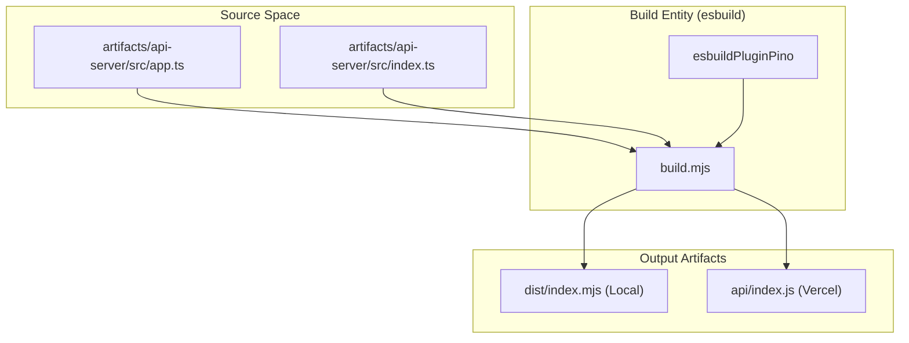
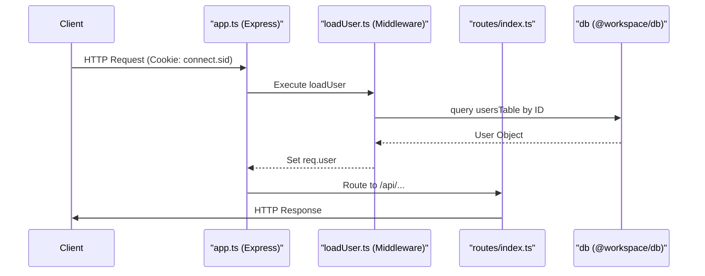

# Backend API Server

Relevant source files

The following files were used as context for generating this wiki page:

- [artifacts/api-server/api/pino-pretty.js](artifacts/api-server/api/pino-pretty.js)
- [artifacts/api-server/api/pino-pretty.js.map](artifacts/api-server/api/pino-pretty.js.map)
- [artifacts/api-server/api/thread-stream-worker.js](artifacts/api-server/api/thread-stream-worker.js)
- [artifacts/api-server/api/thread-stream-worker.js.map](artifacts/api-server/api/thread-stream-worker.js.map)
- [artifacts/api-server/build.mjs](artifacts/api-server/build.mjs)
- [artifacts/api-server/package.json](artifacts/api-server/package.json)
- [artifacts/api-server/src/app.ts](artifacts/api-server/src/app.ts)
- [artifacts/api-server/src/middlewares/loadUser.ts](artifacts/api-server/src/middlewares/loadUser.ts)
- [artifacts/api-server/src/routes/upload.ts](artifacts/api-server/src/routes/upload.ts)
- [artifacts/api-server/vercel.json](artifacts/api-server/vercel.json)
- [lib/db/src/index.ts](lib/db/src/index.ts)

The TraclyTag Backend API Server is an Express-based application responsible for business logic, GS1 code generation, multi-tenant data isolation, and authentication. It serves as the bridge between the React frontend and the LibSQL database, exposing a RESTful API structured around the OpenAPI 3.1 specification.

## Build and Deployment Pipeline

The server uses `esbuild` for rapid bundling and is optimized for deployment on Vercel as a Serverless Function.

*   **Build Script**: The `build.mjs` script handles two distinct build targets: a local server bundled into `dist/index.mjs` and a Vercel-compatible bundle in `api/index.js` [artifacts/api-server/build.mjs:110-140]().
*   **Vercel Integration**: A `vercel.json` file configures a global rewrite, directing all incoming requests to the entry point at `/api/index.js` [artifacts/api-server/vercel.json:3-8]().
*   **External Dependencies**: Heavy or native binaries (e.g., `libsql`, `bcrypt`, `sharp`) are marked as external to avoid bundling issues with `esbuild` [artifacts/api-server/build.mjs:20-95]().

### Build Pipeline Overview
The following diagram maps the build process from source files to deployment artifacts.

Sources: [artifacts/api-server/build.mjs:1-147](), [artifacts/api-server/vercel.json:1-10]()

## Application Architecture

The server is initialized in `app.ts`, where the middleware stack and routing tree are defined.

### Middleware Stack
The server utilizes a standard Express middleware chain for request processing:
1.  **Logging**: `pinoHttp` provides structured logging, utilizing `pino-pretty` for development readability [artifacts/api-server/src/app.ts:15-33]().
2.  **Security**: `cors` is configured to allow credentials and dynamic origins [artifacts/api-server/src/app.ts:34-39]().
3.  **Parsing**: `express.json` and `express.urlencoded` handle incoming payloads, with a 1MB limit on JSON bodies [artifacts/api-server/src/app.ts:40-41]().
4.  **Identity**: `cookieParser` extracts session identifiers, which the `loadUser` middleware uses to hydrate `req.user` from the database [artifacts/api-server/src/app.ts:43-44]().

For details, see [Express App Initialization and Middleware](#2.1).

### Database Connection
The server connects to the database using the `@workspace/db` package. It supports both local SQLite files and remote LibSQL (Turso) instances via environment variables `DATABASE_URL` and `DATABASE_AUTH_TOKEN` [lib/db/src/index.ts:6-14]().

### Request Lifecycle Diagram
This diagram shows how a request flows through the code entities defined in the backend.

Sources: [artifacts/api-server/src/app.ts:43-46](), [artifacts/api-server/src/middlewares/loadUser.ts:5-26](), [lib/db/src/index.ts:1-17]()

## Routing and Features

The API is segmented into logical route groups, all prefixed with `/api` [artifacts/api-server/src/app.ts:46]().

| Route Group | Description | Detail Link |
| :--- | :--- | :--- |
| `/api/auth` | Handles password login, SSO, and WebAuthn/Passkey registration. | [Authentication and Authorization Routes](#2.2) |
| `/api/products` | CRUD operations for GS1 products and GTIN management. | [Product, Batch, and Code Routes](#2.3) |
| `/api/batches` | Management of manufacturing runs and batch metadata. | [Product, Batch, and Code Routes](#2.3) |
| `/api/codes` | GS1 serialization engine for generating and verifying codes. | [Product, Batch, and Code Routes](#2.3) |
| `/api/companies` | Multi-tenant management for Master users. | [Companies, Users, Locations, and Reports Routes](#2.4) |
| `/api/reports` | Aggregated data for stock, marking logs, and traceability. | [Companies, Users, Locations, and Reports Routes](#2.4) |
| `/api/upload` | File upload handling via `multer` for product assets. | See Below |

### File Uploads
The server provides a specialized `/api/upload` endpoint. It uses `multer` to store files in a local `uploads` directory (or `/tmp` on Vercel) [artifacts/api-server/src/routes/upload.ts:10-26](). Uploaded files are served statically under the `/api/uploads` path [artifacts/api-server/src/app.ts:55]().

For details on specific implementations, refer to the child pages:
*   [Express App Initialization and Middleware](#2.1)
*   [Authentication and Authorization Routes](#2.2)
*   [Product, Batch, and Code Routes](#2.3)
*   [Companies, Users, Locations, and Reports Routes](#2.4)

Sources: [artifacts/api-server/src/app.ts:46-55](), [artifacts/api-server/src/routes/upload.ts:1-46]()

---
