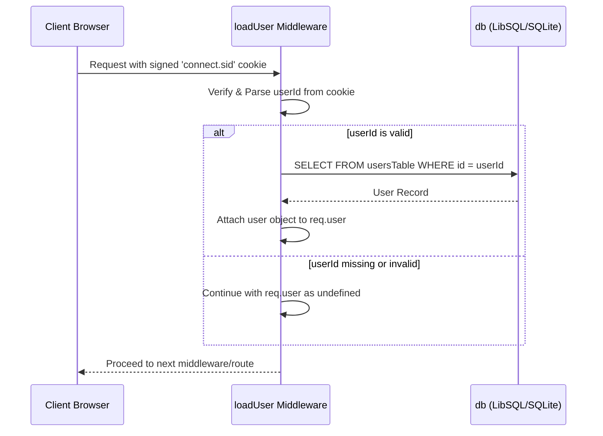

# Express App Initialization and Middleware

<details>
<summary>Relevant source files</summary>

The following files were used as context for generating this wiki page:

- [artifacts/api-server/api/pino-file.js](artifacts/api-server/api/pino-file.js)
- [artifacts/api-server/api/pino-file.js.map](artifacts/api-server/api/pino-file.js.map)
- [artifacts/api-server/api/pino-worker.js](artifacts/api-server/api/pino-worker.js)
- [artifacts/api-server/api/pino-worker.js.map](artifacts/api-server/api/pino-worker.js.map)
- [artifacts/api-server/src/app.ts](artifacts/api-server/src/app.ts)
- [artifacts/api-server/src/middlewares/loadUser.ts](artifacts/api-server/src/middlewares/loadUser.ts)
- [artifacts/api-server/src/routes/upload.ts](artifacts/api-server/src/routes/upload.ts)
- [lib/db/src/index.ts](lib/db/src/index.ts)

</details>


This page details the configuration and startup sequence of the Express-based backend API server. It covers the global middleware stack, session handling, request logging, and the infrastructure for file uploads.

## Middleware Pipeline

The application entry point is defined in `app.ts`, where the Express instance is initialized and configured with a sequential chain of middleware. This chain handles cross-cutting concerns such as security headers, logging, parsing, and authentication before requests reach the route handlers.

### Core Configuration and Security
- **Proxy Trust**: The app is configured with `app.set("trust proxy", 1)` [artifacts/api-server/src/app.ts:13-13]() to correctly identify client IP addresses when running behind a load balancer (e.g., Vercel or Nginx).
- **CORS**: The `cors` middleware is enabled with `credentials: true` [artifacts/api-server/src/app.ts:35-39]() to allow the frontend SPA to send session cookies across origins.
- **Parsing**: Standard body parsers are initialized for JSON (with a 1MB limit) [artifacts/api-server/src/app.ts:40-40]() and URL-encoded data [artifacts/api-server/src/app.ts:41-41]().

### Logging and Observability
The server uses `pino-http` for high-performance logging. It includes custom serializers to sanitize and structure log output:
- **Request Serializer**: Captures the request ID, method, and URL (stripping query parameters for privacy) [artifacts/api-server/src/app.ts:19-25]().
- **Response Serializer**: Captures the HTTP status code [artifacts/api-server/src/app.ts:26-30]().

### Request Lifecycle Diagram

The following diagram illustrates the flow of a request through the middleware stack to the final route handler.

Title: Express Middleware Request Flow
```mermaid
graph TD
    "Client Request" --> "pinoHttp"["pinoHttp (Logging)"]
    "pinoHttp" --> "CORS"["cors (Cross-Origin Resource Sharing)"]
    "CORS" --> "BodyParsers"["express.json & express.urlencoded"]
    "BodyParsers" --> "cookieParser"["cookieParser (Signed Session Cookie)"]
    "cookieParser" --> "loadUser"["loadUser (Database Auth Check)"]
    "loadUser" --> "StaticUploads"["express.static (/api/uploads)"]
    "StaticUploads" --> "Router"["/api Router"]
    "Router" --> "RouteHandler"["Final Route Handler"]
```
**Sources:** [artifacts/api-server/src/app.ts:15-55]()

---

## Session and User Management

The application utilizes signed cookies for session management, rather than a heavy server-side session store.

### Cookie Parsing
The `cookieParser` is initialized using a `SESSION_SECRET` environment variable [artifacts/api-server/src/app.ts:43-43](). This secret is used to sign cookies, ensuring they cannot be tampered with by the client.

### User Context (loadUser)
The `loadUser` middleware is responsible for hydrating the `req.user` object:
1. It extracts the `userId` from the signed cookie named `connect.sid` [artifacts/api-server/src/middlewares/loadUser.ts:6-7]().
2. If a valid ID exists, it queries the `usersTable` in the database [artifacts/api-server/src/middlewares/loadUser.ts:12-15]().
3. If the user is found, their profile (id, username, email, role, and companyId) is attached to the `req` object [artifacts/api-server/src/middlewares/loadUser.ts:17-24]().

Title: Authentication Hydration Logic

**Sources:** [artifacts/api-server/src/middlewares/loadUser.ts:5-26](), [artifacts/api-server/src/app.ts:43-44]()

---

## File Uploads and Static Assets

The server provides a mechanism for uploading assets (e.g., product images) using `multer` and serving them via Express static middleware.

### Directory Configuration
The upload directory is environment-aware:
- **Production (Vercel)**: Uses `/tmp` for ephemeral storage [artifacts/api-server/src/routes/upload.ts:10-12]().
- **Development**: Uses a local `uploads` directory relative to the server root [artifacts/api-server/src/app.ts:49-51]().
The server ensures this directory exists during initialization [artifacts/api-server/src/app.ts:52-54]().

### Multer Storage Engine
The `multer.diskStorage` engine is configured to:
1. Save files to the determined `uploadDir` [artifacts/api-server/src/routes/upload.ts:18-20]().
2. Generate unique filenames using a combination of the field name, a timestamp, and a random suffix to prevent collisions [artifacts/api-server/src/routes/upload.ts:21-25]().
3. Enforce a 10MB file size limit [artifacts/api-server/src/routes/upload.ts:30-32]().

### Upload Route Implementation
The `/api/upload` endpoint [artifacts/api-server/src/routes/upload.ts:35-44]() integrates several components:
- **Authentication**: Protected by `requireAuth` middleware.
- **Processing**: Uses `upload.single("file")` to process the multipart/form-data request.
- **Response**: Returns a relative URL (e.g., `/api/uploads/file-123.jpg`) that maps to the static file server.

### Static File Serving
The middleware `app.use("/api/uploads", express.static(uploadDir))` [artifacts/api-server/src/app.ts:55-55]() exposes the uploaded files to the web, allowing the frontend to display product images by prefixing the filename with the API base path.

**Sources:** [artifacts/api-server/src/app.ts:49-55](), [artifacts/api-server/src/routes/upload.ts:10-46]()

---
