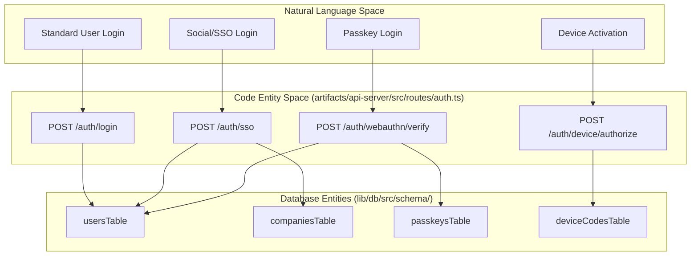
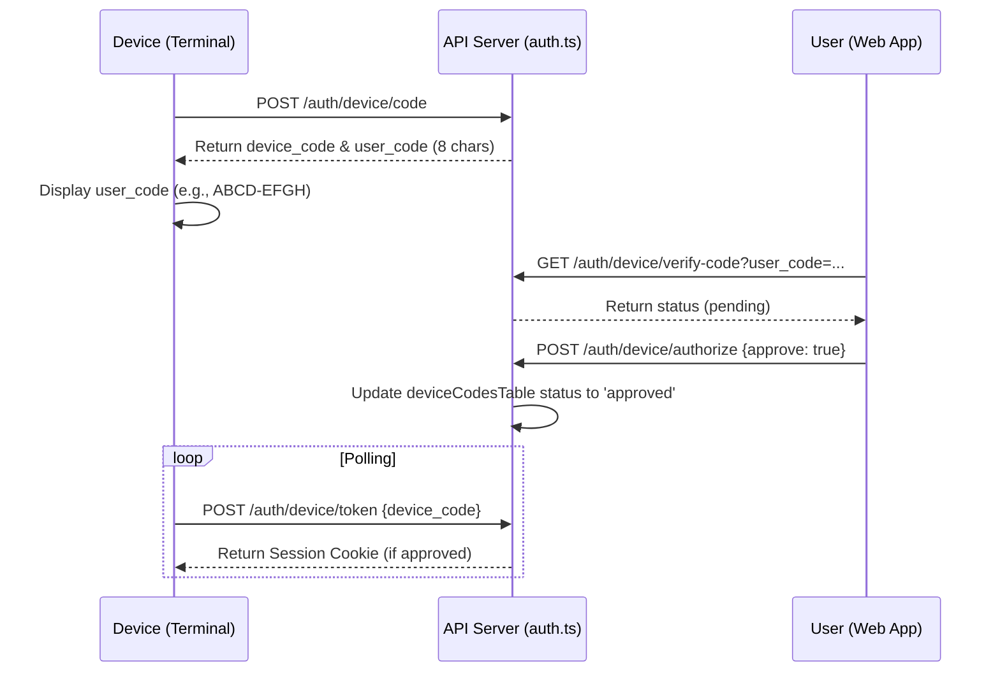

# Authentication and Authorization Routes

Relevant source files

The following files were used as context for generating this wiki page:

- [artifacts/api-server/src/routes/auth.ts](artifacts/api-server/src/routes/auth.ts)
- [artifacts/traclytag/src/pages/activate.tsx](artifacts/traclytag/src/pages/activate.tsx)
- [lib/api-zod/src/generated/types/authSession.ts](lib/api-zod/src/generated/types/authSession.ts)
- [lib/api-zod/src/generated/types/loginBody.ts](lib/api-zod/src/generated/types/loginBody.ts)
- [lib/api-zod/src/generated/types/registerBody.ts](lib/api-zod/src/generated/types/registerBody.ts)
- [lib/db/src/schema/deviceCodes.ts](lib/db/src/schema/deviceCodes.ts)
- [lib/db/src/schema/passkeys.ts](lib/db/src/schema/passkeys.ts)

This section covers the implementation of the `/api/auth/*` endpoints, which handle user registration, multi-method authentication (Password, SSO, WebAuthn), and the OAuth2-inspired Device Authorization Grant flow.

## Overview of Authentication Architecture

The system uses session-based authentication. Upon successful login or registration, the server issues a signed `connect.sid` cookie containing the user's ID [artifacts/api-server/src/routes/auth.ts:67-73](). This cookie is managed via the `cookie-parser` middleware and is secured based on the environment (e.g., `secure: true` in production) [artifacts/api-server/src/routes/auth.ts:123-130]().

### Identity Data Flow
The following diagram illustrates how different authentication methods converge on the `usersTable` and `companiesTable` entities.

**Authentication Entity Mapping**

**Sources:** [artifacts/api-server/src/routes/auth.ts:4-10](), [lib/db/src/schema/users.ts:1-5](), [lib/db/src/schema/passkeys.ts:4-15](), [lib/db/src/schema/deviceCodes.ts:4-14]()

---

## Core Authentication Endpoints

### Registration and Login
- **`POST /auth/register`**: Validates input using `RegisterBody` [artifacts/api-server/src/routes/auth.ts:10-15](). It creates a new entry in `companiesTable` followed by a `client_admin` user in `usersTable` [artifacts/api-server/src/routes/auth.ts:32-60](). Passwords are hashed using `bcryptjs` with a salt round of 10 [artifacts/api-server/src/routes/auth.ts:47]().
- **`POST /auth/login`**: Verifies the username and compares the provided password against the stored hash [artifacts/api-server/src/routes/auth.ts:98-112]().
- **`POST /auth/logout`**: Clears the `connect.sid` cookie [artifacts/api-server/src/routes/auth.ts:145]().

### SSO (Single Sign-On)
The `/auth/sso` endpoint handles federated identity. If a user does not exist upon SSO callback, the system automatically creates a new company and a corresponding `client_admin` user [artifacts/api-server/src/routes/auth.ts:199-238](). A random 16-byte hex password is generated for the new account to satisfy schema requirements [artifacts/api-server/src/routes/auth.ts:220-221]().

**Sources:** [artifacts/api-server/src/routes/auth.ts:10-255](), [lib/api-zod/src/generated/types/registerBody.ts:9-18]()

---

## WebAuthn and Passkeys

The system supports FIDO2/WebAuthn for passwordless authentication. This is managed via the `passkeysTable`, which stores the public key and signature counter [lib/db/src/schema/passkeys.ts:4-15]().

1.  **Registration (`/auth/webauthn/register`)**: Associates a new credential ID and public key with the currently authenticated `userId` [artifacts/api-server/src/routes/auth.ts:285-296]().
2.  **Verification (`/auth/webauthn/verify`)**: Validates the assertion signature against the stored `publicKey`. Upon success, it updates the `counter` to prevent replay attacks and issues a session cookie [artifacts/api-server/src/routes/auth.ts:320-350]().

**Sources:** [artifacts/api-server/src/routes/auth.ts:262-355](), [lib/db/src/schema/passkeys.ts:4-15]()

---

## Device Authorization Grant (Device Flow)

For devices with limited input capabilities (e.g., scanners, terminals), TraclyTag implements a flow where the device generates a code for the user to approve on a secondary device.

### Sequence of Operations
The flow uses the `deviceCodesTable` to track the lifecycle of an authorization request [lib/db/src/schema/deviceCodes.ts:4-14]().

**Device Flow Logic**

### Key Functions
- **`POST /auth/device/code`**: Generates a 32-character `deviceCode` and an 8-character `userCode`. It sets an expiration time (default 5 minutes) [artifacts/api-server/src/routes/auth.ts:365-385]().
- **`POST /auth/device/authorize`**: Requires the user to be logged in. It updates the `status` of the `deviceCode` entry to 'approved' or 'denied' [artifacts/api-server/src/routes/auth.ts:435-460]().
- **`POST /auth/device/token`**: The device polls this endpoint. If the status is 'approved', the server issues a session cookie for the `userId` associated with the grant [artifacts/api-server/src/routes/auth.ts:470-510]().

**Sources:** [artifacts/api-server/src/routes/auth.ts:360-520](), [artifacts/traclytag/src/pages/activate.tsx:46-99](), [lib/db/src/schema/deviceCodes.ts:4-14]()

---

## Authorization Middleware

### `requireAuth`
Access control is enforced via the `requireAuth` middleware. It checks for the existence of `req.user` (populated by the `loadUser` middleware in the main app stack).

- **Authentication Check**: If `req.user` is missing, it returns `401 Unauthorized`.
- **Role-Based Access Control (RBAC)**: Some routes further restrict access based on the `role` field in `usersTable` (e.g., `master_admin`, `client_admin`, `operator`).

**Sources:** [artifacts/api-server/src/routes/auth.ts:150-153](), [lib/api-zod/src/generated/types/authSession.ts:10-19]()

---
