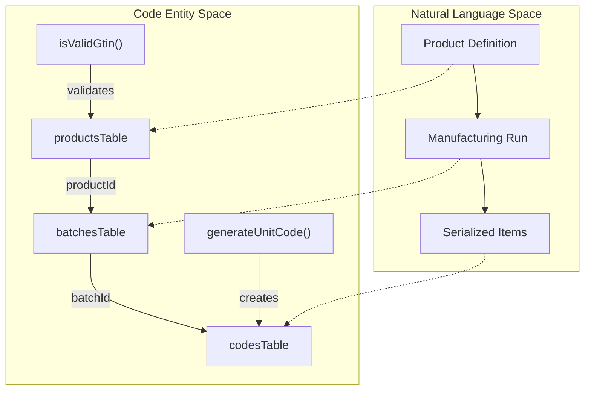
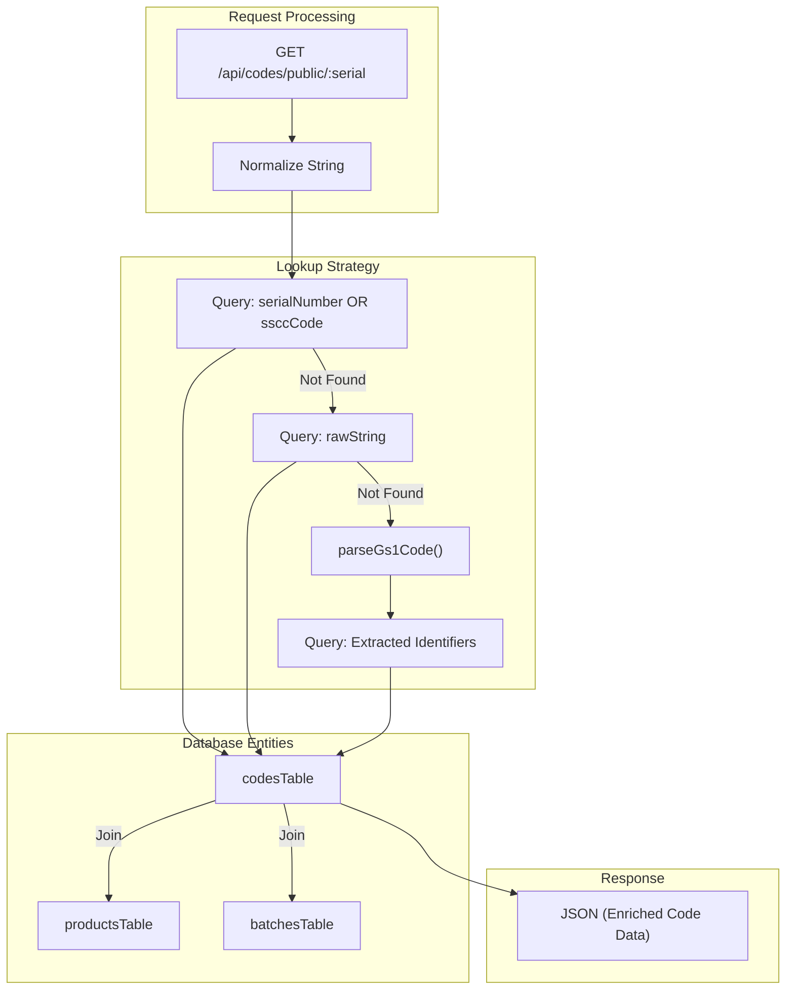

# Product, Batch, and Code Routes

Relevant source files

The following files were used as context for generating this wiki page:

- [artifacts/api-server/src/lib/gs1.ts](artifacts/api-server/src/lib/gs1.ts)
- [artifacts/api-server/src/routes/batches.ts](artifacts/api-server/src/routes/batches.ts)
- [artifacts/api-server/src/routes/codes.ts](artifacts/api-server/src/routes/codes.ts)
- [artifacts/api-server/src/routes/index.ts](artifacts/api-server/src/routes/index.ts)
- [artifacts/api-server/src/routes/products.ts](artifacts/api-server/src/routes/products.ts)
- [lib/api-zod/src/generated/types/batch.ts](lib/api-zod/src/generated/types/batch.ts)
- [lib/api-zod/src/generated/types/code.ts](lib/api-zod/src/generated/types/code.ts)
- [lib/api-zod/src/generated/types/createBatchBody.ts](lib/api-zod/src/generated/types/createBatchBody.ts)
- [lib/api-zod/src/generated/types/generateCodesBody.ts](lib/api-zod/src/generated/types/generateCodesBody.ts)
- [lib/api-zod/src/generated/types/generateCodesResponse.ts](lib/api-zod/src/generated/types/generateCodesResponse.ts)

This section documents the core supply chain API routes responsible for managing the product lifecycle, manufacturing runs (batches), and GS1-compliant serialization (codes). These routes form the backbone of the traceability system, moving from static product definitions to unique digital identities for physical items.

## Product Management

The `/api/products` routes handle the CRUD operations for product master data. Products serve as the parent entity for all batches and codes.

### Implementation Details
*   **GTIN Validation**: The system enforces GS1 standards by validating the Global Trade Item Number (GTIN) check digit during creation using the `isValidGtin` utility [artifacts/api-server/src/routes/products.ts:44-47]().
*   **Multi-Tenancy**: Product access is strictly filtered by `companyId`. Users with the `master` role can view all products, while standard users are restricted to their own company's catalog [artifacts/api-server/src/routes/products.ts:12-28]().
*   **Packaging Hierarchy**: Product definitions include dimensions for various packaging levels (`l1Size`, `l2Size`, `shipperSize`), which are used later during code aggregation and mapping [artifacts/api-server/src/routes/products.ts:69-71]().

| Method | Endpoint | Description |
| :--- | :--- | :--- |
| `GET` | `/api/products` | Lists products filtered by the user's `companyId`. |
| `POST` | `/api/products` | Creates a new product; validates GTIN and enforces company context. |
| `DELETE` | `/api/products/:id` | Removes a product definition from the database. |

**Sources:** [artifacts/api-server/src/routes/products.ts:1-98](), [artifacts/api-server/src/lib/gs1.ts:15-21]()

---

## Batch Management

The `/api/batches` routes manage manufacturing runs. A batch represents a specific production instance of a product, containing manufacturing and expiry dates.

### Batch Lifecycle
1.  **Creation**: A batch is linked to a `productId`. The `batchNumber` must be unique within the scope of that product [artifacts/api-server/src/routes/batches.ts:75-78]().
2.  **Date Handling**: Manufacturing (`mfgDate`) and expiry (`expiryDate`) dates are stored as ISO strings and are critical for GS1 code generation [artifacts/api-server/src/routes/batches.ts:55-56]().
3.  **Filtering**: Batches can be filtered by `productId` via query parameters [artifacts/api-server/src/routes/batches.ts:12-19]().

**Sources:** [artifacts/api-server/src/routes/batches.ts:1-92](), [lib/api-zod/src/generated/types/batch.ts:9-17]()

---

## Code Generation and Serialization

The `/api/codes` routes handle the generation of GS1-compliant serial numbers (Unit codes) and SSCC (Serial Shipping Container Codes).

### GS1 Serialization Logic
The `gs1.ts` library provides the core logic for constructing the raw GS1 strings used in barcodes and QR codes.

*   **Unit Codes (AI 01, 17, 10, 21)**: Combines GTIN, Expiry, Batch, and a unique 9-character random serial number [artifacts/api-server/src/lib/gs1.ts:63-72](). It uses the `FNC1` character (ASCII 232) as a separator [artifacts/api-server/src/lib/gs1.ts:3-3]().
*   **SSCC (AI 00)**: Generates 18-digit Serial Shipping Container Codes using a company prefix and a random serial reference, concluding with a calculated check digit [artifacts/api-server/src/lib/gs1.ts:76-88]().

### Public Verification Flow
The endpoint `/api/codes/public/:serial` allows unauthenticated access for consumers to verify product authenticity.

1.  **Normalization**: The system trims the input and handles scanner prefixes (e.g., `::`) [artifacts/api-server/src/routes/codes.ts:102-106]().
2.  **Multi-Step Lookup**:
    *   **Direct Match**: Checks `serialNumber` or `ssccCode` columns [artifacts/api-server/src/routes/codes.ts:111-116]().
    *   **Raw String Match**: Checks the full GS1 string [artifacts/api-server/src/routes/codes.ts:125-130]().
    *   **GS1 Parsing**: Uses `parseGs1Code` to extract identifiers from complex strings and retries the lookup [artifacts/api-server/src/routes/codes.ts:133-153]().

### Code Mapping
The `MapCodeBody` is used to associate a generated code with a specific physical location or to mark it as "mapped" (activated) in the supply chain [artifacts/api-server/src/routes/codes.ts:12]().

**Sources:** [artifacts/api-server/src/routes/codes.ts:51-178](), [artifacts/api-server/src/lib/gs1.ts:1-163](), [lib/api-zod/src/generated/types/code.ts:10-49]()

---

## Data Flow Diagrams

### Product-to-Code Lifecycle
This diagram illustrates how data flows from the initial product definition through batch creation to the generation of serialized codes.

**Sources:** [artifacts/api-server/src/routes/products.ts:57-80](), [artifacts/api-server/src/routes/batches.ts:50-58](), [artifacts/api-server/src/lib/gs1.ts:63-72]()

### Public Verification Logic
This diagram details the logic within the `codes.ts` router for resolving a scanned string to a database record.

**Sources:** [artifacts/api-server/src/routes/codes.ts:102-153](), [artifacts/api-server/src/lib/gs1.ts:91-162]()

## API Reference Summary

| Entity | Route | Key Functions/Classes | Zod Schema |
| :--- | :--- | :--- | :--- |
| **Product** | `/api/products` | `isValidGtin` | `CreateProductBody` |
| **Batch** | `/api/batches` | `db.insert(batchesTable)` | `CreateBatchBody` |
| **Code** | `/api/codes` | `generateUnitCode`, `parseGs1Code` | `GenerateCodesBody` |

**Sources:** [artifacts/api-server/src/routes/index.ts:19-22](), [lib/api-zod/src/generated/types/generateCodesBody.ts:10-18](), [lib/api-zod/src/generated/types/createBatchBody.ts:9-14]()

---
