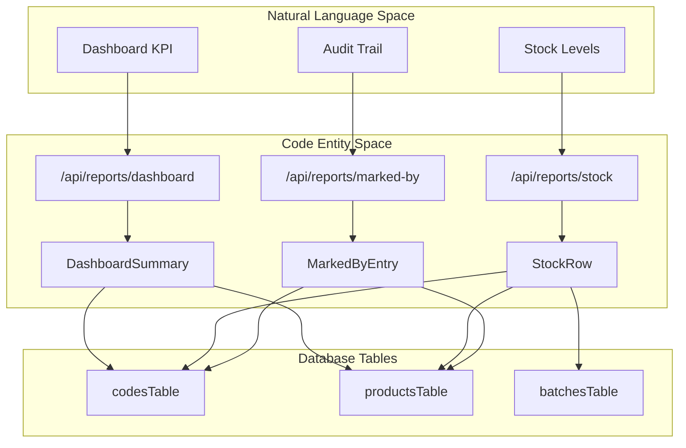
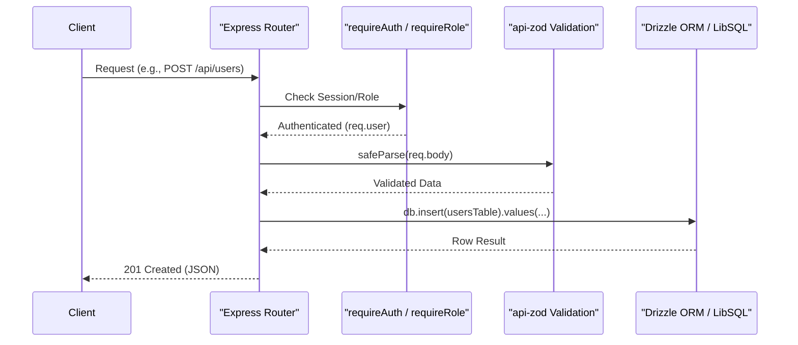

# Companies, Users, Locations, and Reports Routes

Relevant source files

The following files were used as context for generating this wiki page:

- [artifacts/api-server/src/routes/companies.ts](artifacts/api-server/src/routes/companies.ts)
- [artifacts/api-server/src/routes/locations.ts](artifacts/api-server/src/routes/locations.ts)
- [artifacts/api-server/src/routes/reports.ts](artifacts/api-server/src/routes/reports.ts)
- [artifacts/api-server/src/routes/users.ts](artifacts/api-server/src/routes/users.ts)
- [lib/api-zod/src/generated/types/dashboardSummary.ts](lib/api-zod/src/generated/types/dashboardSummary.ts)
- [lib/api-zod/src/generated/types/markedByEntry.ts](lib/api-zod/src/generated/types/markedByEntry.ts)
- [lib/api-zod/src/generated/types/palletSummaryRow.ts](lib/api-zod/src/generated/types/palletSummaryRow.ts)
- [lib/api-zod/src/generated/types/productReportRow.ts](lib/api-zod/src/generated/types/productReportRow.ts)
- [lib/api-zod/src/generated/types/shipperSummaryRow.ts](lib/api-zod/src/generated/types/shipperSummaryRow.ts)
- [lib/api-zod/src/generated/types/stockRow.ts](lib/api-zod/src/generated/types/stockRow.ts)

This section details the administrative and analytical API route groups within the TraclyTag backend. These routes handle multi-tenant organization management, Role-Based Access Control (RBAC) for users, physical distribution point tracking, and the aggregation of supply chain data for dashboarding and reporting.

## Companies Management (`/api/companies`)

The `/api/companies` routes manage the multi-tenant structure of the platform. Access to these endpoints is strictly controlled via the `requireRole("master")` middleware [artifacts/api-server/src/routes/companies.ts:21](), ensuring that only super-administrators can create or delete tenant organizations.

### Implementation Details
- **List Companies**: Returns all registered companies ordered by creation date [artifacts/api-server/src/routes/companies.ts:11-17]().
- **Create Company**: Validates input using `CreateCompanyBody` from `@workspace/api-zod` [artifacts/api-server/src/routes/companies.ts:23](). It records the organization's name, email, address, and GSTIN [artifacts/api-server/src/routes/companies.ts:28-36]().
- **Delete Company**: Removes a company record by ID [artifacts/api-server/src/routes/companies.ts:41-54]().

**Sources:** [artifacts/api-server/src/routes/companies.ts:1-57]().

## User Management (`/api/users`)

The `/api/users` routes handle the administration of platform users. The system implements a hierarchical scoping mechanism: `master` users can see and manage all users across all companies, while `admin` users are restricted to their own `companyId` [artifacts/api-server/src/routes/users.ts:29-33]().

### RBAC and Scoping
- **Listing**: Uses a `leftJoin` with `companiesTable` to provide company names alongside user details [artifacts/api-server/src/routes/users.ts:13-26]().
- **Creation**: 
    - Enforces password hashing using `bcrypt` [artifacts/api-server/src/routes/users.ts:53]().
    - Prevents non-master users from creating other `master` accounts [artifacts/api-server/src/routes/users.ts:47-50]().
    - Automatically injects the creator's `companyId` for non-master admins [artifacts/api-server/src/routes/users.ts:46]().
- **Deletion**: Prevents self-deletion to avoid accidental lockout [artifacts/api-server/src/routes/users.ts:100-103]().

### User Data Flow
| Action | Validator | Entity | Logic |
| :--- | :--- | :--- | :--- |
| POST | `CreateUserBody` | `usersTable` | Hash password -> Insert -> Return with `companyName` |
| GET | N/A | `usersTable` | Filter by `req.user.companyId` unless role is `master` |

**Sources:** [artifacts/api-server/src/routes/users.ts:1-109]().

## Locations (`/api/locations`)

Locations represent warehouses, distribution centers, or retail points. These are used to track where codes are mapped or stored.

- **Multi-tenancy**: Queries are filtered by `req.user.companyId` [artifacts/api-server/src/routes/locations.ts:21]().
- **Data Points**: Tracks `locationType`, `uniqueName`, `contactNo`, and full address details [artifacts/api-server/src/routes/locations.ts:39-48]().

**Sources:** [artifacts/api-server/src/routes/locations.ts:1-65]().

## Reports and Dashboard (`/api/reports`)

The reports module aggregates data across `codesTable`, `batchesTable`, and `productsTable` to provide business intelligence. All reports utilize a `companyScope` helper to ensure data isolation [artifacts/api-server/src/routes/reports.ts:18-22]().

### Dashboard Summary
The `/api/reports/dashboard` endpoint performs multiple aggregations to populate the main UI dashboard:
- **KPI Cards**: Total counts for products, batches, codes, locations, users, and companies [artifacts/api-server/src/routes/reports.ts:44-90]().
- **Mapping Status**: A sum-case SQL query calculates `mapped` vs `unmapped` codes in a single pass [artifacts/api-server/src/routes/reports.ts:62-63]().
- **Recent Activity**: Returns the 10 most recently created codes with joined product and batch metadata [artifacts/api-server/src/routes/reports.ts:91-117]().

### Specialized Reports
1.  **Stock Report**: Grouped by product and batch to show current inventory levels and mapping progress [artifacts/api-server/src/routes/reports.ts:143-176]().
2.  **Product Report**: Includes SKU size information for manufacturing analysis [artifacts/api-server/src/routes/reports.ts:178-203]().
3.  **Marked-By Log**: A detailed audit trail of which users mapped which codes, including timestamps and location data [artifacts/api-server/src/routes/reports.ts:205-210]().

### Data Aggregation Logic
The reporting engine uses the `dateRangeConds` utility to filter data by `createdAt` timestamps, supporting "from" and "to" parameters [artifacts/api-server/src/routes/reports.ts:24-39]().

### Report Data Mapping
Title: Report Entity Mapping

**Sources:** [artifacts/api-server/src/routes/reports.ts:1-210](), [lib/api-zod/src/generated/types/dashboardSummary.ts:11-22](), [lib/api-zod/src/generated/types/stockRow.ts:9-19](), [lib/api-zod/src/generated/types/markedByEntry.ts:10-21]().

## Route Security and Flow

All routes in these groups follow a standardized middleware pattern for security and validation.

Title: Request Processing Flow

**Sources:** [artifacts/api-server/src/routes/users.ts:10-36](), [artifacts/api-server/src/routes/companies.ts:9-23](), [artifacts/api-server/src/routes/reports.ts:16]().

---
