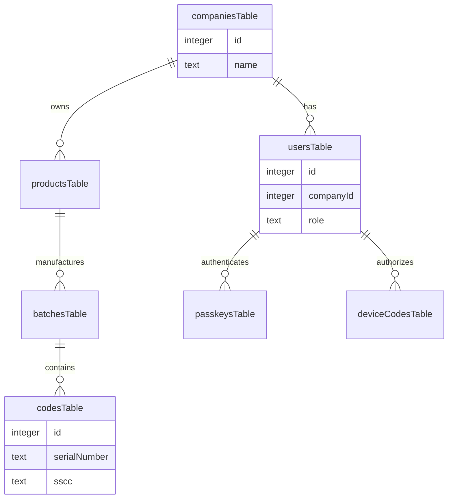

# Database Layer

<details>
<summary>Relevant source files</summary>

The following files were used as context for generating this wiki page:

- [artifacts/api-server/src/app.ts](artifacts/api-server/src/app.ts)
- [artifacts/api-server/src/middlewares/loadUser.ts](artifacts/api-server/src/middlewares/loadUser.ts)
- [artifacts/api-server/src/routes/upload.ts](artifacts/api-server/src/routes/upload.ts)
- [lib/db/drizzle.config.ts](lib/db/drizzle.config.ts)
- [lib/db/src/index.ts](lib/db/src/index.ts)
- [lib/db/src/schema/index.ts](lib/db/src/schema/index.ts)

</details>


The Database Layer of TraclyTag is managed within the `@workspace/db` package. It utilizes **LibSQL** (a fork of SQLite) as the storage engine and **Drizzle ORM** for type-safe database interactions and schema management. This layer is designed to support both local development with file-based SQLite and production environments using **Turso**.

### Architecture Overview

The database architecture focuses on multi-tenancy and GS1 traceability. The `db` object is initialized using the `@libsql/client`, which handles connections to either a local file or a remote Turso instance based on environment variables.

#### Database Connectivity Flow
The following diagram illustrates how the `api-server` interacts with the LibSQL backend through the `db` package.

**Title: Database Connection and Query Flow**
```mermaid
graph LR
    subgraph "Code Entity Space"
        [api-server] -- "imports" --> [db_instance]
        [db_instance] -- "uses" --> [libsql_client]
    end

    subgraph "Infrastructure Space"
        [libsql_client] -- "DATABASE_URL" --> [SQLite_File]
        [libsql_client] -- "DATABASE_AUTH_TOKEN" --> [Turso_Cloud]
    end

    [db_instance]:::code
    [libsql_client]:::code
    [api-server]:::code

    classDef code font-family:monospace
```
Sources: [lib/db/src/index.ts:1-14](), [lib/db/drizzle.config.ts:1-10]()

### Drizzle ORM Setup

TraclyTag uses Drizzle ORM to provide a TypeScript-first developer experience. The configuration is centralized in `drizzle.config.ts`, which specifies the schema location and the `turso` dialect.

| Component | Code Reference | Description |
| :--- | :--- | :--- |
| **Client Initialization** | `createClient` | Creates the LibSQL connection using `DATABASE_URL`. |
| **ORM Instance** | `db` | The exported Drizzle instance used for all queries. |
| **Schema Hub** | `schema/index.ts` | Aggregates all table definitions for the ORM. |
| **Migration Tool** | `drizzle-kit` | Used for generating and pushing schema changes. |

Sources: [lib/db/src/index.ts:9-14](), [lib/db/drizzle.config.ts:3-10](), [lib/db/src/schema/index.ts:1-9]()

### Schema Organization

The schema is modularized into functional domains. Each domain is defined in its own file and exported through a central index. This structure supports complex relationships required for GS1 serialization, such as the hierarchy between companies, products, batches, and individual serial numbers (codes).

**Title: Schema Entity Relationships**

Sources: [lib/db/src/schema/index.ts:1-8](), [artifacts/api-server/src/middlewares/loadUser.ts:12-24]()

For a deep dive into specific table definitions, foreign keys, and the multi-tenant `companyId` implementation, see **[Database Schema](#3.1)**.

### Development and Migrations

The workflow for database changes involves using `drizzle-kit` to synchronize the TypeScript schema with the LibSQL backend. During local development, the server defaults to a local file named `traclytag.db`.

*   **Local Backend:** Uses a local SQLite file via `file:path/to/traclytag.db`.
*   **Production Backend:** Connects to Turso using a secure `DATABASE_AUTH_TOKEN`.
*   **Seeding:** A dedicated script populates the database with initial data (users, products, and GS1 codes) to facilitate testing.

For instructions on running migrations and using the seeding script, see **[Database Seeding and Local Development](#3.2)**.

Sources: [lib/db/src/index.ts:6-12](), [lib/db/drizzle.config.ts:5-9]()

---
