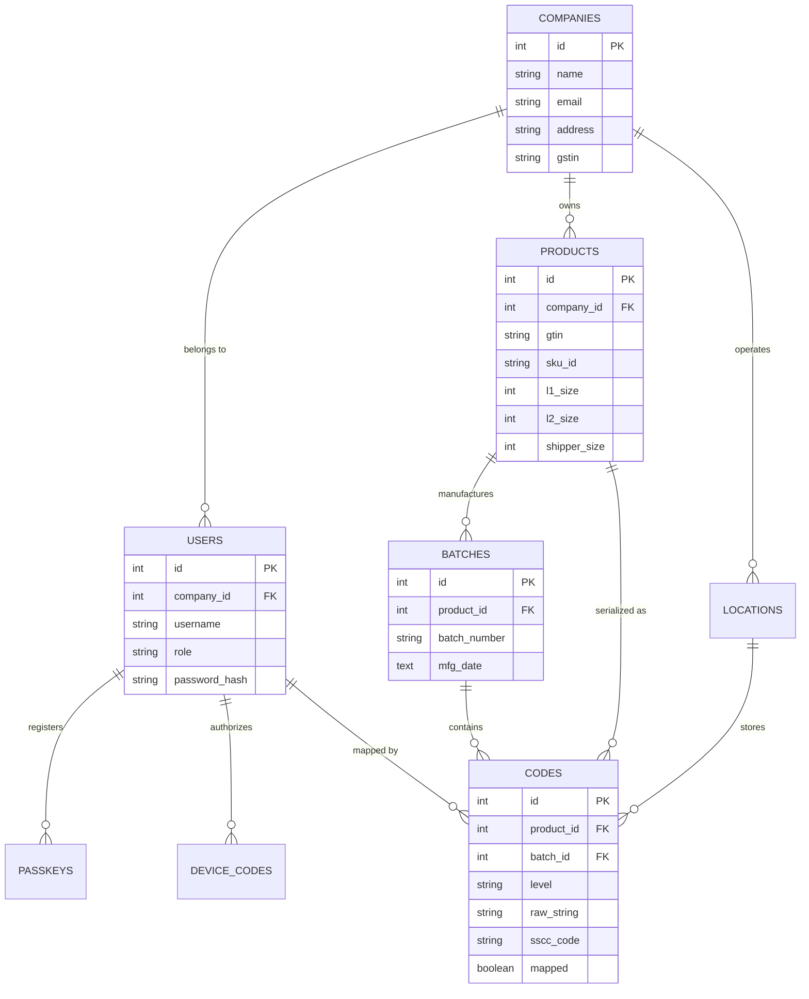
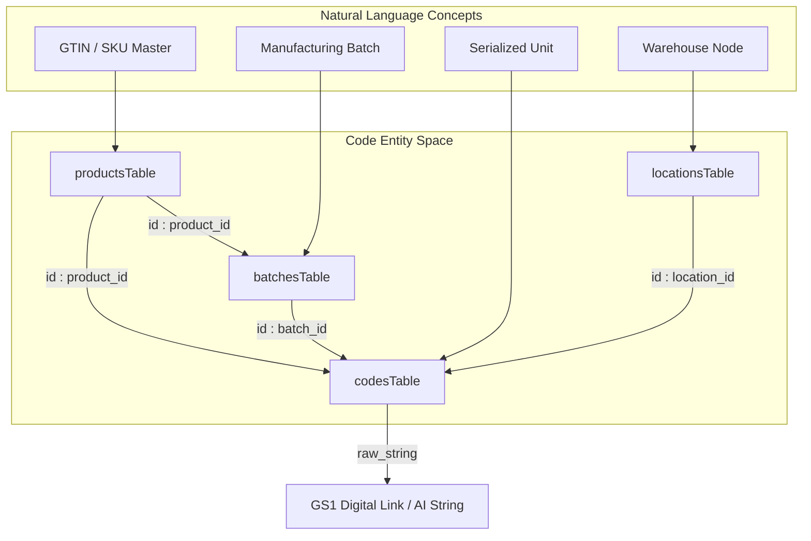

# Database Schema

Relevant source files

The following files were used as context for generating this wiki page:

- [artifacts/traclytag/src/pages/products.tsx](artifacts/traclytag/src/pages/products.tsx)
- [lib/db/src/schema/batches.ts](lib/db/src/schema/batches.ts)
- [lib/db/src/schema/deviceCodes.ts](lib/db/src/schema/deviceCodes.ts)
- [lib/db/src/schema/index.ts](lib/db/src/schema/index.ts)
- [lib/db/src/schema/passkeys.ts](lib/db/src/schema/passkeys.ts)
- [lib/db/src/schema/products.ts](lib/db/src/schema/products.ts)
- [lib/db/traclytag.db](lib/db/traclytag.db)
- [traclytag.db](traclytag.db)

This page documents the TraclyTag database architecture, implemented using **Drizzle ORM** and **LibSQL/SQLite**. The schema is designed to support multi-tenancy, GS1-compliant product serialization, and modern authentication methods including WebAuthn (Passkeys) and Device Authorization Grants.

## Architecture Overview

The database follows a relational structure where `companies` serve as the primary tenant container. Most entities, including users, products, and locations, are bound to a `companyId` to ensure data isolation.

### Entity Relationship Diagram

The following diagram illustrates the relationships between the core tables defined in `lib/db/src/schema/`.

**Core Database Schema**

**Sources:** [lib/db/src/schema/index.ts:1-9](), [lib/db/traclytag.db:1-81]()

---

## Multi-Tenancy and Identity

### Companies and Users
The `companiesTable` represents the top-level tenant. The `usersTable` references this via `companyId`. Users are assigned roles (e.g., `master`, `admin`, `operator`) which control access to data within their company context [lib/db/traclytag.db:66-81]().

### Authentication Entities
TraclyTag supports advanced authentication beyond standard passwords:
*   **Passkeys**: The `passkeysTable` stores WebAuthn credentials, including public keys and signature counters, linked to a specific user [lib/db/src/schema/passkeys.ts:4-15]().
*   **Device Codes**: The `deviceCodesTable` facilitates the Device Authorization Grant flow (RFC 8628), allowing hardware terminals to be linked to a user account via a short `userCode` [lib/db/src/schema/deviceCodes.ts:4-14]().

**Sources:** [lib/db/src/schema/passkeys.ts:4-15](), [lib/db/src/schema/deviceCodes.ts:4-14](), [lib/db/traclytag.db:66-81]()

---

## Product and Supply Chain Logic

### Product Hierarchy
The `productsTable` defines the master data for a SKU. Crucially, it defines the **Packaging Hierarchy** via three size fields:
*   `l1Size`: Quantity in Level 1 packaging.
*   `l2Size`: Quantity in Level 2 packaging.
*   `shipperSize`: Total quantity in a shipper/pallet [lib/db/src/schema/products.ts:15-17]().

### Batches and Manufacturing
Manufacturing runs are tracked in `batchesTable`. A unique constraint is enforced on the combination of `productId` and `batchNumber` to prevent duplicate entries for the same product [lib/db/src/schema/batches.ts:4-11]().

### Serialized Codes
The `codesTable` is the central repository for all generated GS1 identities. It supports multiple levels of serialization:
*   **GTIN + Serial**: For individual units, stored in `serialNumber`.
*   **SSCC**: For logistic units (pallets/shippers), stored in `sscc_code` [lib/db/traclytag.db:30-47]().

The `mapped` flag indicates if a physical QR/Barcode has been associated with the digital record. When mapping occurs, the `mapped_by_user_id` and `location_id` are recorded to provide a full audit trail [lib/db/traclytag.db:38-41]().

**Sources:** [lib/db/src/schema/products.ts:4-23](), [lib/db/src/schema/batches.ts:4-11](), [lib/db/traclytag.db:30-47]()

---

## Table Definitions Reference

| Table | File Path | Key Purpose |
| :--- | :--- | :--- |
| `companies` | [lib/db/src/schema/companies.ts]() | Tenant master records. |
| `users` | [lib/db/src/schema/users.ts]() | User identity and RBAC roles. |
| `products` | [lib/db/src/schema/products.ts]() | SKU master data and GS1 GTINs. |
| `locations` | [lib/db/src/schema/locations.ts]() | Warehouse and distribution nodes. |
| `batches` | [lib/db/src/schema/batches.ts]() | Production run data (Mfg/Expiry). |
| `codes` | [lib/db/src/schema/codes.ts]() | Serial numbers, SSCCs, and mapping state. |
| `passkeys` | [lib/db/src/schema/passkeys.ts]() | WebAuthn/FIDO2 credential storage. |
| `device_codes` | [lib/db/src/schema/deviceCodes.ts]() | OAuth2 Device Flow state. |

---

## Data Flow: Code Generation to Mapping

The following diagram bridges the natural language concept of "Product Serialization" to the specific database entities and fields used in the code.

**Serialization Data Flow**

**Sources:** [lib/db/traclytag.db:9-65](), [lib/db/src/schema/codes.ts:1-47]()

### Multi-Tenancy Implementation
Multi-tenancy is enforced at the database level using foreign keys to `companiesTable.id`. In the API layer, the `companyId` is typically extracted from the authenticated user's session and injected into Drizzle queries to filter results.

*   **Users**: Linked via `company_id` [lib/db/traclytag.db:73-75]().
*   **Products**: Linked via `company_id` [lib/db/src/schema/products.ts:6]().
*   **Locations**: Linked via `company_id` [lib/db/traclytag.db:49-58]().

**Sources:** [lib/db/src/schema/products.ts:6](), [lib/db/traclytag.db:49-75]()

---
