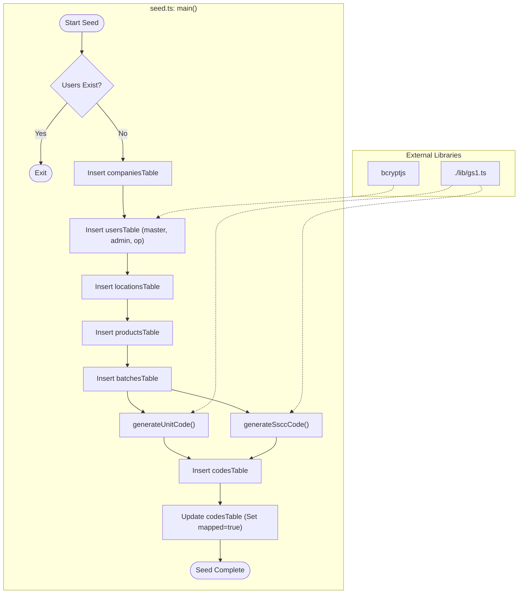

# Database Seeding and Local Development

<details>
<summary>Relevant source files</summary>

The following files were used as context for generating this wiki page:

- [artifacts/api-server/src/seed.ts](artifacts/api-server/src/seed.ts)
- [artifacts/api-server/traclytag.db](artifacts/api-server/traclytag.db)
- [lib/db/drizzle.config.ts](lib/db/drizzle.config.ts)
- [start.txt](start.txt)
- [traclytag.db](traclytag.db)

</details>


This page details the mechanisms for initializing the TraclyTag database for local development and testing. It covers the seeding script logic, the transition between local SQLite and production Turso/LibSQL, and the configuration of the Drizzle ORM.

## Overview of Database Seeding

The seeding process is handled by a dedicated script `seed.ts` located within the `api-server` artifact [artifacts/api-server/src/seed.ts:1-252](). This script populates the database with a hierarchical set of data necessary to simulate a multi-tenant pharmaceutical supply chain environment.

The script performs an idempotency check at the beginning: if the `usersTable` already contains records, it terminates to prevent duplicate data entry [artifacts/api-server/src/seed.ts:16-20]().

### Seeding Hierarchy and Logic

The `main()` function in `seed.ts` follows a specific insertion order to satisfy foreign key constraints defined in the schema:

1.  **Company**: Creates a primary tenant "Demo Pharma Pvt Ltd" [artifacts/api-server/src/seed.ts:23-31]().
2.  **Users**: Generates three distinct personas using `bcryptjs` for password hashing [artifacts/api-server/src/seed.ts:35-64]():
    *   `master`: A platform-wide administrator (no `companyId`).
    *   `demo_admin`: A tenant-level administrator for the demo company.
    *   `demo_op`: An operational user for scanning and mapping.
3.  **Locations**: Establishes a distribution network including a Warehouse, a Distributor, and a Retailer [artifacts/api-server/src/seed.ts:68-102]().
4.  **Products**: Inserts GS1-compliant products (e.g., Paracetamol, Vitamin C) with pre-calculated GTINs [artifacts/api-server/src/seed.ts:107-147]().
5.  **Batches**: Links manufacturing runs to products with specific expiry and manufacturing dates [artifacts/api-server/src/seed.ts:151-167]().
6.  **Codes**: Generates unit-level (GTIN + Serial) and aggregation-level (SSCC) codes using the GS1 library [artifacts/api-server/src/seed.ts:171-234]().

### Logic Flow for Seeding

The following diagram illustrates the data flow within the `seed.ts` execution context.

**Data Generation Flow in seed.ts**

**Sources:** [artifacts/api-server/src/seed.ts:13-252](), [artifacts/api-server/src/seed.ts:11-11]()

---

## Local Development vs. Production

TraclyTag utilizes the LibSQL dialect, which allows for a seamless transition between a local file-based SQLite database and a hosted Turso instance.

### Configuration (`drizzle.config.ts`)

The database connection is managed via `drizzle.config.ts`. It defaults to a local file named `traclytag.db` if no environment variable is provided [lib/db/drizzle.config.ts:1-10]().

| Environment | Driver/Dialect | Connection URL | Auth Token |
| :--- | :--- | :--- | :--- |
| **Local Dev** | `turso` (LibSQL) | `file:./traclytag.db` | Not required |
| **Production** | `turso` (LibSQL) | `process.env.DATABASE_URL` | `process.env.DATABASE_AUTH_TOKEN` |

**Sources:** [lib/db/drizzle.config.ts:3-9](), [artifacts/api-server/traclytag.db:1-85]()

### Local File Usage
In development, the file `artifacts/api-server/traclytag.db` serves as the persistent storage. This file contains the full relational structure, including tables for `products`, `codes`, `batches`, `locations`, `users`, and `companies` [artifacts/api-server/traclytag.db:2-85]().

---

## Code Generation and Mapping during Seed

A critical part of the seeding process is the generation of GS1-compliant strings and the simulation of "Mapping" (the act of assigning a physical code to a location/owner).

### Code Generation Functions
The seed script imports two key utilities from the GS1 library:
*   `generateUnitCode`: Creates a GS1 DataMatrix string containing AI(01) for GTIN, AI(17) for Expiry, AI(10) for Batch, and AI(21) for Serial Number [artifacts/api-server/src/seed.ts:181-185]().
*   `generateSsccCode`: Creates a Serial Shipping Container Code (SSCC) for shippers and pallets [artifacts/api-server/src/seed.ts:211-211]().

### Mapping Simulation
After generating codes, the script simulates real-world usage by updating a subset of codes (the first 12) to a `mapped` state [artifacts/api-server/src/seed.ts:237-248](). This associates the `codesTable` entries with a `locationId` and a `mappedByUserId` [artifacts/api-server/traclytag.db:31-34]().

**Code-to-Entity Mapping**
```mermaid
classDiagram
    class "seed.ts" {
        +main()
    }
    class "db" {
        <<@workspace/db>>
    }
    class "codesTable" {
        +id: integer
        +product_id: integer
        +batch_id: integer
        +raw_string: text
        +mapped: boolean
        +location_id: integer
    }
    class "gs1_lib" {
        +generateUnitCode()
        +generateSsccCode()
    }

    "seed.ts" --> "db" : Executes queries
    "seed.ts" --> "gs1_lib" : Generates GS1 strings
    "db" -- "codesTable" : Manages
    "codesTable" ..> "artifacts/api-server/traclytag.db" : Persists to
```
**Sources:** [artifacts/api-server/src/seed.ts:1-11](), [artifacts/api-server/traclytag.db:23-40]()

---

## Running the Development Environment

To start the local development environment with the seeded database, use the following commands from the monorepo root:

1.  **Install dependencies**: `pnpm install`
2.  **Initialize Database**: Ensure migrations are applied via Drizzle-kit.
3.  **Run Seed**: (Typically executed via a script defined in `package.json` that runs `ts-node artifacts/api-server/src/seed.ts`).
4.  **Start Services**:
    *   Backend: `pnpm --filter @workspace/api-server run dev` [start.txt:1-1]()
    *   Frontend: `pnpm --filter @workspace/traclytag run dev` [start.txt:2-2]()

**Sources:** [start.txt:1-3]()

---
