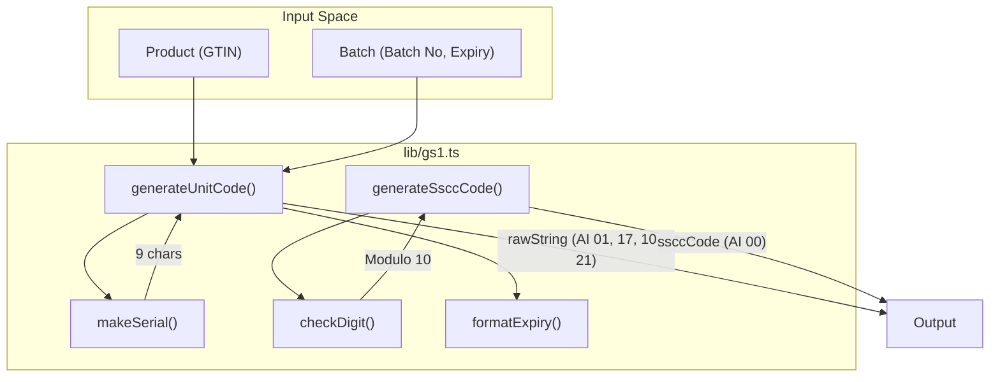
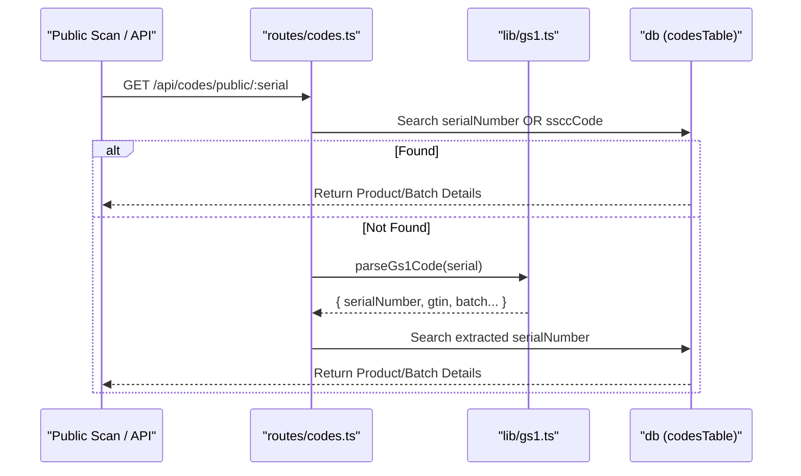

# GS1 Serialization Engine

Relevant source files

The following files were used as context for generating this wiki page:

- [artifacts/api-server/src/lib/gs1.ts](artifacts/api-server/src/lib/gs1.ts)
- [artifacts/api-server/src/routes/codes.ts](artifacts/api-server/src/routes/codes.ts)
- [artifacts/api-server/src/routes/index.ts](artifacts/api-server/src/routes/index.ts)
- [lib/api-zod/src/generated/types/codeLevel.ts](lib/api-zod/src/generated/types/codeLevel.ts)

The GS1 Serialization Engine is the core logic responsible for generating, validating, and parsing GS1-compliant identifiers. It ensures that all products, batches, and logistics units (pallets/shippers) follow the global standards for supply chain traceability. The implementation is centralized in the `lib/gs1.ts` utility library.

## Core Logic and Standards Compliance

The engine implements the GS1 General Specifications, specifically focusing on GTIN-13/14 validation, the Luhn-style check digit algorithm, and Application Identifier (AI) formatting.

### Check Digit Algorithm
The `checkDigit` function implements the standard GS1 modulo-10 algorithm used for GTINs and SSCCs. It weights alternating digits by 3 and 1, starting from the right [artifacts/api-server/src/lib/gs1.ts:5-13]().

### GTIN Validation
The `isValidGtin` function validates Global Trade Item Numbers. It supports both 13-digit and 14-digit formats by padding 13-digit strings with a leading zero before verifying the 14th digit against the calculated check digit [artifacts/api-server/src/lib/gs1.ts:15-21]().

### The FNC1 Separator
GS1 barcodes often contain variable-length data fields. To distinguish where one field ends and another begins, the engine uses the **FNC1** character (ASCII 232).
- **Definition:** `FNC1` is defined as `String.fromCharCode(232)` [artifacts/api-server/src/lib/gs1.ts:3-3]().
- **Usage:** It is inserted after variable-length AIs like Batch/Lot (10) to separate them from subsequent fields [artifacts/api-server/src/lib/gs1.ts:70-70]().

---

## Code Generation Workflows

The engine provides two primary generation functions: `generateUnitCode` for individual product items and `generateSsccCode` for logistics containers.

### Unit Code Generation (GTIN + Serial)
This function creates a GS1 DataMatrix string for individual units. It concatenates multiple Application Identifiers:
- **(01)**: GTIN (14 digits)
- **(17)**: Expiry Date (YYMMDD format)
- **(10)**: Batch/Lot Number (Variable length)
- **(21)**: Serial Number (9-character alphanumeric)

**Unit Code Structure Mapping:**
| Component | AI | Logic |
| :--- | :--- | :--- |
| GTIN | 01 | Padded to 14 digits [artifacts/api-server/src/lib/gs1.ts:67-67]() |
| Expiry | 17 | Formatted via `formatExpiry` to UTC YYMMDD [artifacts/api-server/src/lib/gs1.ts:27-33]() |
| Batch | 10 | Appended directly from input [artifacts/api-server/src/lib/gs1.ts:70-70]() |
| Serial | 21 | Generated via `makeSerial` using `crypto.randomBytes` [artifacts/api-server/src/lib/gs1.ts:35-43]() |

### SSCC Generation (Logistics Units)
The Serial Shipping Container Code (SSCC) is used for shippers and pallets. It is an 18-digit identifier preceded by AI (00).
- **Extension Digit:** Hardcoded to "1" [artifacts/api-server/src/lib/gs1.ts:80-80]().
- **Company Prefix:** Derived from the GTIN or company settings, padded to 7 digits [artifacts/api-server/src/lib/gs1.ts:81-81]().
- **Serial Reference:** 9 random digits [artifacts/api-server/src/lib/gs1.ts:82-82]().
- **Check Digit:** Calculated over the 17 preceding digits [artifacts/api-server/src/lib/gs1.ts:84-85]().

### Serialization Flow Diagram
This diagram illustrates how natural language entities (Product, Batch) are transformed into code-level GS1 strings via `lib/gs1.ts`.

**Sources:** [artifacts/api-server/src/lib/gs1.ts:57-88]()

---

## Parsing and Verification

The system must be able to reverse-engineer raw barcode scans to identify products in the database.

### GS1 String Parsing
The `parseGs1Code` function decomposes a raw string into its constituent parts. It first normalizes the string by replacing the `FNC1` character with a pipe `|` for easier regex/split operations [artifacts/api-server/src/lib/gs1.ts:102-102](). It then iterates through the string, identifying AIs and capturing their associated values based on fixed lengths (AI 00, 01, 17) or variable terminators (AI 10, 21) [artifacts/api-server/src/lib/gs1.ts:105-159]().

### Public Verification Logic
When a user scans a code, the `/api/codes/public/:serial` route uses the GS1 engine to resolve the identity of the item.

**Verification Resolution Order:**
1. **Direct Lookup:** Matches the input directly against `codesTable.serialNumber` or `codesTable.ssccCode` [artifacts/api-server/src/routes/codes.ts:111-116]().
2. **Raw Match:** Matches against the full `codesTable.rawString` (useful for barcode scans) [artifacts/api-server/src/routes/codes.ts:125-125]().
3. **GS1 Parse:** Uses `parseGs1Code` to extract a serial or SSCC from a complex GS1 string and searches again using the extracted identifiers [artifacts/api-server/src/routes/codes.ts:133-153]().

### Verification Data Flow
This diagram maps the public API request to the internal GS1 parsing and database lookup logic.

**Sources:** [artifacts/api-server/src/routes/codes.ts:51-153](), [artifacts/api-server/src/lib/gs1.ts:91-162]()

---

## Key Functions Summary

| Function | File | Purpose |
| :--- | :--- | :--- |
| `checkDigit` | `lib/gs1.ts` | Calculates GS1/Luhn modulo-10 check digit. |
| `isValidGtin` | `lib/gs1.ts` | Validates GTIN-13/14 format and check digit. |
| `generateUnitCode` | `lib/gs1.ts` | Generates AI-prefixed raw strings for individual items. |
| `generateSsccCode` | `lib/gs1.ts` | Generates 18-digit SSCCs for logistics units. |
| `parseGs1Code` | `lib/gs1.ts` | Extracts AI data (GTIN, Serial, Batch) from raw scans. |
| `makeSerial` | `lib/gs1.ts` | Creates cryptographically random 9-char alphanumeric serials. |

**Sources:** [artifacts/api-server/src/lib/gs1.ts:1-163]()

---
