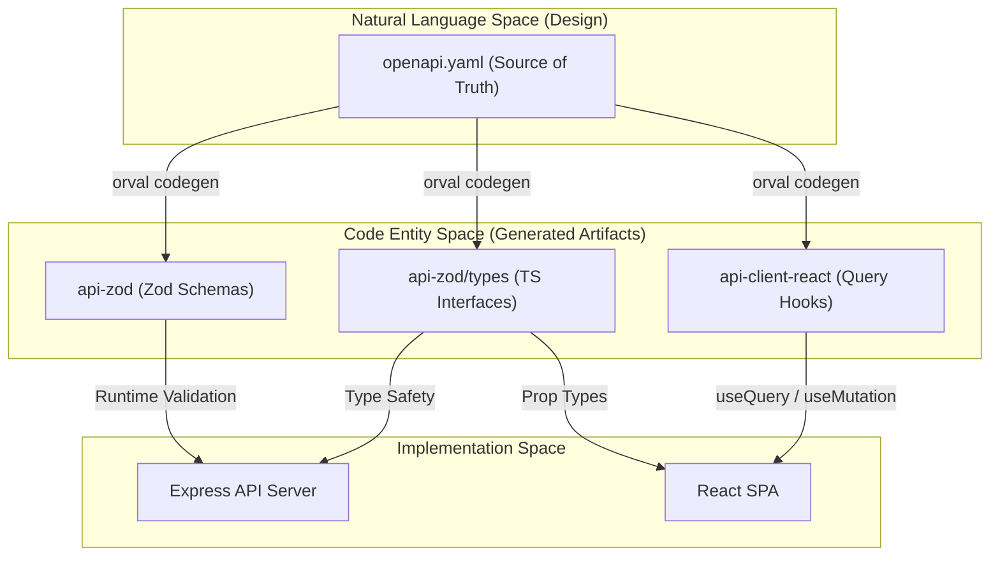

# Shared API Contract Libraries

Relevant source files

The following files were used as context for generating this wiki page:

- [lib/api-client-react/src/generated/api.schemas.ts](lib/api-client-react/src/generated/api.schemas.ts)
- [lib/api-client-react/src/generated/api.ts](lib/api-client-react/src/generated/api.ts)
- [lib/api-spec/openapi.yaml](lib/api-spec/openapi.yaml)
- [lib/api-spec/package.json](lib/api-spec/package.json)
- [lib/api-zod/src/generated/api.ts](lib/api-zod/src/generated/api.ts)
- [lib/api-zod/src/generated/types/index.ts](lib/api-zod/src/generated/types/index.ts)

The TraclyTag codebase employs a "Spec-First" development approach. The API contract is defined in a central OpenAPI specification, which is then used to generate validation schemas, TypeScript types, and React hooks. This ensures strict synchronization between the Express backend and the React frontend.

The contract is managed across three primary packages in the `lib/` directory:
1.  `@workspace/api-spec`: The source of truth (OpenAPI YAML).
2.  `@workspace/api-zod`: Runtime validation and shared types.
3.  `@workspace/api-client-react`: Type-safe data fetching hooks.

### Contract Flow Diagram

The following diagram illustrates how the API contract propagates from the specification to the functional code entities in both the backend and frontend.

**API Contract Propagation**

**Sources:** [lib/api-spec/package.json:6-6](), [lib/api-spec/openapi.yaml:1-10]()

---

## 5.1 OpenAPI Specification (api-spec)

The `@workspace/api-spec` package contains the `openapi.yaml` file, which defines the entire TraclyTag API surface. It uses OpenAPI 3.1.0 to document endpoints, security requirements, and data models.

*   **Single Source of Truth**: All endpoints (e.g., `/auth/login`, `/products`, `/codes`) are defined here first [lib/api-spec/openapi.yaml:38-270]().
*   **Code Generation**: The package uses `orval` to trigger the generation of downstream libraries [lib/api-spec/package.json:6-6]().
*   **Tags**: Operations are grouped by tags such as `auth`, `products`, and `reports` to organize the generated client hooks [lib/api-spec/openapi.yaml:12-21]().

For details, see [OpenAPI Specification (api-spec)](#5.1).

**Sources:** [lib/api-spec/openapi.yaml:1-21](), [lib/api-spec/package.json:1-11]()

---

## 5.2 Zod Schemas and TypeScript Types (api-zod)

The `@workspace/api-zod` package provides the bridge between static types and runtime validation. It contains Zod schemas generated directly from the OpenAPI components.

*   **Runtime Validation**: The backend uses schemas like `LoginBody` [lib/api-zod/src/generated/api.ts:22-25]() and `CreateProductBody` [lib/api-zod/src/generated/api.ts:139-155]() to validate incoming request payloads.
*   **Shared Types**: It exports TypeScript interfaces for every API entity, such as `Product`, `Batch`, and `Code` [lib/api-zod/src/generated/types/index.ts:1-42]().
*   **Consistency**: Because these are generated, any change in the `openapi.yaml` (like adding a `gstin` field to a `Company`) immediately updates the validation logic and type definitions across the monorepo [lib/api-zod/src/generated/api.ts:75-80]().

For details, see [Zod Schemas and TypeScript Types (api-zod)](#5.2).

**Sources:** [lib/api-zod/src/generated/api.ts:1-155](), [lib/api-zod/src/generated/types/index.ts:1-43]()

---

## 5.3 React Query API Client (api-client-react)

The `@workspace/api-client-react` package provides a high-level, type-safe interface for the frontend to interact with the API.

*   **Generated Hooks**: It produces TanStack Query hooks for every operation, such as `useLogin` [lib/api-client-react/src/generated/api.ts:205-214]() and `useHealthCheck` [lib/api-client-react/src/generated/api.ts:127-137]().
*   **Custom Fetch Wrapper**: All generated hooks utilize a `customFetch` utility [lib/api-client-react/src/generated/api.ts:56-57]() which handles base URLs, authentication headers, and standardized error parsing using the `ErrorResponse` schema [lib/api-client-react/src/generated/api.schemas.ts:12-14]().
*   **Intelligent Caching**: Hooks are generated with consistent query keys (e.g., `getHealthCheckQueryKey`) [lib/api-client-react/src/generated/api.ts:94-98](), enabling automated cache invalidation across the application.

For details, see [React Query API Client (api-client-react)](#5.3).

**Sources:** [lib/api-client-react/src/generated/api.ts:8-214](), [lib/api-client-react/src/generated/api.schemas.ts:1-14]()

---

### Shared Schema Mapping

This table maps key API entities to their generated Zod and TypeScript representations used across the workspace.

| Entity | OpenAPI Component | Zod Schema (api-zod) | React Hook (api-client) |
| :--- | :--- | :--- | :--- |
| **Auth** | `AuthSession` | `LoginResponse` | `useLogin` |
| **Product** | `Product` | `ListProductsResponseItem` | `useListProducts` |
| **Batch** | `Batch` | `ListBatchesResponseItem` | `useListBatches` |
| **Code** | `Code` | `ListCodesResponseItem` | `useGenerateCodes` |
| **Company** | `Company` | `ListCompaniesResponseItem` | `useListCompanies` |

**Sources:** [lib/api-spec/openapi.yaml:38-270](), [lib/api-zod/src/generated/api.ts:27-251](), [lib/api-client-react/src/generated/api.ts:156-214]()

---
