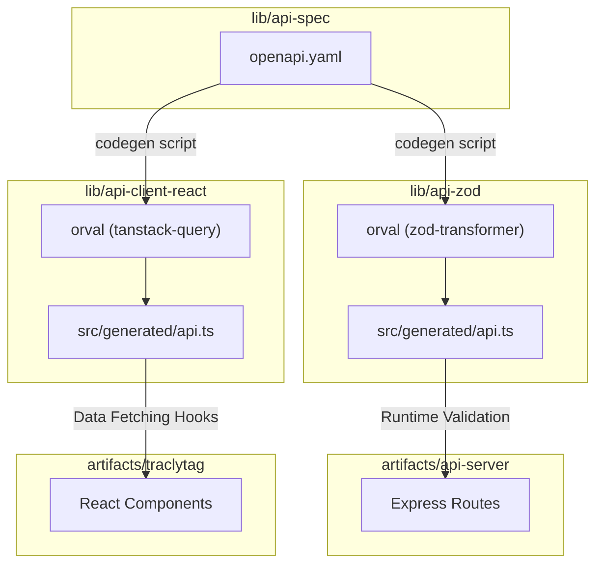
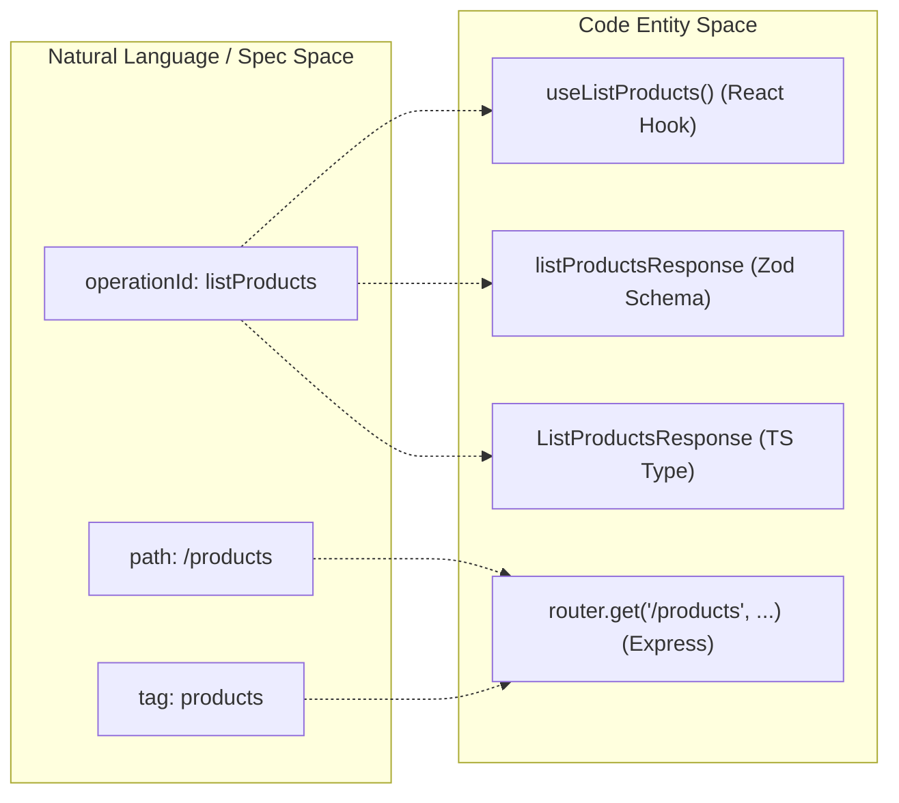

# OpenAPI Specification (api-spec)

Relevant source files

The following files were used as context for generating this wiki page:

- [lib/api-spec/openapi.yaml](lib/api-spec/openapi.yaml)
- [lib/api-spec/package.json](lib/api-spec/package.json)

The `@workspace/api-spec` package serves as the **single source of truth** for the TraclyTag ecosystem. It defines the contract between the Express backend and the React frontend using the OpenAPI 3.1.0 specification. This specification is used to automatically generate Zod validation schemas, TypeScript interfaces, and TanStack Query hooks, ensuring end-to-end type safety and reducing manual boilerplate.

### Specification Overview

The core of the package is the `openapi.yaml` file. It defines the API metadata, server configurations, and categorized endpoints using tags [lib/api-spec/openapi.yaml:1-21]().

| Component | Description |
| :--- | :--- |
| **Version** | OpenAPI 3.1.0 [lib/api-spec/openapi.yaml:1]() |
| **Base Path** | `/api` [lib/api-spec/openapi.yaml:9]() |
| **Tags** | `health`, `auth`, `companies`, `users`, `products`, `locations`, `batches`, `codes`, `reports` [lib/api-spec/openapi.yaml:12-21]() |

### Data Flow and Code Generation

The specification drives the development lifecycle through an automated code generation pipeline. When the YAML file is updated, the `codegen` script [lib/api-spec/package.json:6]() triggers `orval` to transform the specification into executable code in sibling libraries.

#### API Contract Propagation
The following diagram illustrates how the `openapi.yaml` file propagates through the monorepo:

**System Entity Propagation Diagram**

Sources: [lib/api-spec/package.json:6](), [lib/api-spec/openapi.yaml:1-36]()

### Key API Definitions

The specification defines both the structure of the endpoints and the underlying data models (schemas).

#### Endpoint Examples
Endpoints are defined with unique `operationId` values, which become the names of the generated functions and hooks [lib/api-spec/openapi.yaml:26,40,96]().

*   **Authentication**: Handles session management through `login`, `register`, and `logout` operations [lib/api-spec/openapi.yaml:38-93]().
*   **Resource Management**: Standard CRUD operations for `products`, `batches`, and `locations` [lib/api-spec/openapi.yaml:202-273]().
*   **Multi-tenancy**: The `companies` tag identifies endpoints restricted to master-level administration [lib/api-spec/openapi.yaml:113-155]().

#### Schema Components
Schemas defined in `#/components/schemas` ensure that complex objects like `AuthSession`, `Product`, and `ErrorResponse` are consistent across the stack [lib/api-spec/openapi.yaml:55,61,214]().

### Implementation Mapping

The relationship between the OpenAPI definitions and the actual code entities is strict. Every `operationId` in the YAML corresponds to a generated hook in the frontend and a route handler in the backend.

**OpenAPI to Code Entity Mapping**

Sources: [lib/api-spec/openapi.yaml:202-214](), [lib/api-spec/package.json:6]()

### Technical Details of Generation

The `codegen` process is executed via `pnpm run codegen` within the `lib/api-spec` directory [lib/api-spec/package.json:6]().

1.  **Orval Execution**: Reads `orval.config.ts` (located in the same directory) to determine output targets.
2.  **Zod Generation**: Creates validation schemas in `lib/api-zod/src/generated/api.ts`.
3.  **Client Generation**: Creates TanStack Query hooks in `lib/api-client-react/src/generated/api.ts`.
4.  **Index Export**: A post-generation node script updates the entry point for `api-zod` to ensure all generated exports are available to the server [lib/api-spec/package.json:6]().

Sources: [lib/api-spec/package.json:1-11](), [lib/api-spec/openapi.yaml:1-112]()

---
