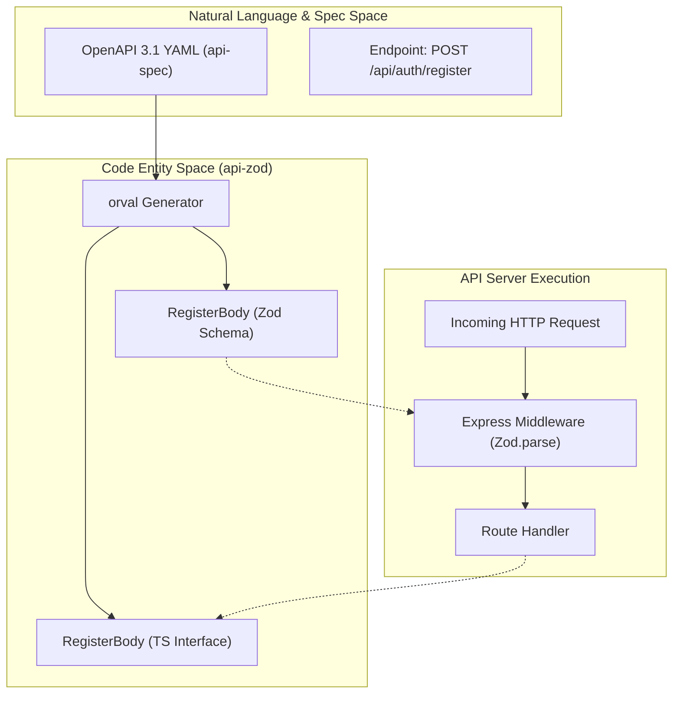

# Zod Schemas and TypeScript Types (api-zod)

<details>
<summary>Relevant source files</summary>

The following files were used as context for generating this wiki page:

- [lib/api-zod/src/generated/api.ts](lib/api-zod/src/generated/api.ts)
- [lib/api-zod/src/generated/types/createBatchBody.ts](lib/api-zod/src/generated/types/createBatchBody.ts)
- [lib/api-zod/src/generated/types/createProductBody.ts](lib/api-zod/src/generated/types/createProductBody.ts)
- [lib/api-zod/src/generated/types/errorResponse.ts](lib/api-zod/src/generated/types/errorResponse.ts)
- [lib/api-zod/src/generated/types/generateCodesBody.ts](lib/api-zod/src/generated/types/generateCodesBody.ts)
- [lib/api-zod/src/generated/types/index.ts](lib/api-zod/src/generated/types/index.ts)
- [lib/api-zod/src/generated/types/registerBody.ts](lib/api-zod/src/generated/types/registerBody.ts)
- [lib/api-zod/src/generated/types/role.ts](lib/api-zod/src/generated/types/role.ts)

</details>


The `@workspace/api-zod` package serves as the bridge between the OpenAPI specification and the runtime validation logic used by the API server. It provides auto-generated **Zod schemas** for validating request bodies, query parameters, and path variables, alongside corresponding **TypeScript types** for compile-time safety across the monorepo.

## Overview and Generation Workflow

This package is entirely generated using `orval` [lib/api-zod/src/generated/api.ts:2-7](). By consuming the OpenAPI YAML defined in `@workspace/api-spec`, it ensures that the backend implementation and frontend requests strictly adhere to the defined contract.

### Data Flow: Specification to Runtime

The following diagram illustrates how the OpenAPI definitions are transformed into actionable code entities used by the Express server.

**API Contract Transformation Map**

**Sources:** [lib/api-zod/src/generated/api.ts:1-7](), [lib/api-zod/src/generated/types/registerBody.ts:1-18]()

## Package Structure

The package is organized into two primary areas: monolithic Zod schema exports and granular TypeScript type definitions.

### 1. Zod Schemas (`api.ts`)
The `api.ts` file contains all Zod schema definitions. These are used primarily by the API server to validate incoming data at the edge of the route handlers.

*   **Request Body Validation:** Schemas like `LoginBody` [lib/api-zod/src/generated/api.ts:22-25]() and `CreateProductBody` [lib/api-zod/src/generated/api.ts:139-155]() ensure that incoming JSON payloads contain the correct fields and types.
*   **Parameter Validation:** Path parameters (e.g., `DeleteCompanyParams` [lib/api-zod/src/generated/api.ts:83-85]()) and query parameters (e.g., `ListCodesQueryParams` [lib/api-zod/src/generated/api.ts:225-230]()) use `zod.coerce` to safely transform string inputs from URLs into numbers or dates.
*   **Response Validation:** While primarily used for documentation, schemas like `GetCurrentUserResponse` [lib/api-zod/src/generated/api.ts:54-61]() define the expected shape of data sent back to the client.

### 2. TypeScript Types (`types/` directory)
The `types/` directory contains individual files for every schema defined in the API, allowing for clean imports.

| Entity Type | Example File | Description |
| :--- | :--- | :--- |
| **Request Bodies** | `createBatchBody.ts` | Defines fields for creating manufacturing runs [lib/api-zod/src/generated/types/createBatchBody.ts:9-14](). |
| **Domain Models** | `role.ts` | Defines the RBAC roles: `master`, `client_admin`, `operator` [lib/api-zod/src/generated/types/role.ts:12-16](). |
| **Response Items** | `product.ts` | The structure of a product record returned by the API [lib/api-zod/src/generated/types/index.ts:36](). |
| **Enums** | `codeLevel.ts` | Valid levels for GS1 codes: `unit`, `l1`, `l2`, `shipper`, `pallet` [lib/api-zod/src/generated/api.ts:238](). |

**Sources:** [lib/api-zod/src/generated/types/index.ts:1-42](), [lib/api-zod/src/generated/api.ts:8-250]()

## Implementation Details

### Type-Safe Validations
The generated schemas leverage Zod features to enforce business rules defined in the OpenAPI spec. For example, the `GenerateCodesBody` schema enforces a minimum of 1 and a maximum of 5000 for the quantity field [lib/api-zod/src/generated/types/generateCodesBody.ts:13-18]().

### Complex Object Mapping
The following diagram shows how a complex domain entity like a `Product` is represented across the Zod schema and the TypeScript interface.

**Product Entity Code Association**
```mermaid
classDiagram
    class "ListProductsResponseItem (Zod)" {
        +id: zod.number()
        +gtin: zod.string()
        +l1Size: zod.number()
        +expiryDate: zod.coerce.date()
    }
    class "CreateProductBody (Interface)" {
        +skuId: string
        +name: string
        +gtin: string
        +mrp: number
        +expiryDate: Date
    }
    
    "ListProductsResponseItem (Zod)" ..> "CreateProductBody (Interface)" : "Validates input for"
```
**Sources:** [lib/api-zod/src/generated/api.ts:116-135](), [lib/api-zod/src/generated/types/createProductBody.ts:9-31]()

### Key Generated Schemas

| Schema Name | Purpose | Key Fields |
| :--- | :--- | :--- |
| `LoginBody` | Authentication | `username`, `password` [lib/api-zod/src/generated/api.ts:22-25]() |
| `RegisterBody` | Multi-tenant Onboarding | `companyName`, `companyEmail`, `password` [lib/api-zod/src/generated/api.ts:40-48]() |
| `ListCodesQueryParams` | Filtering generated codes | `level`, `batchId`, `productId`, `limit` [lib/api-zod/src/generated/api.ts:225-230]() |
| `CreateProductBody` | Product Master Entry | `gtin` (14 digit), `skuId`, `l1Size`, `l2Size` [lib/api-zod/src/generated/api.ts:139-155]() |

## Consumption by API Server

The API server consumes these schemas within its route handlers to provide immediate feedback on invalid requests.

1.  **Parsing:** When a request hits an endpoint (e.g., `/api/batches`), the server calls `CreateBatchBody.parse(req.body)` [lib/api-zod/src/generated/api.ts:210-215]().
2.  **Coercion:** For URL parameters like `:id`, the server uses `DeleteBatchParams` which utilizes `zod.coerce.number()` to convert the string segment into a valid integer [lib/api-zod/src/generated/api.ts:218-220]().
3.  **Error Handling:** If validation fails, Zod throws an error which the server catches to return a standardized `ErrorResponse` [lib/api-zod/src/generated/types/errorResponse.ts:9-11]().

**Sources:** [lib/api-zod/src/generated/api.ts:210-220](), [lib/api-zod/src/generated/types/errorResponse.ts:9-11]()

---
