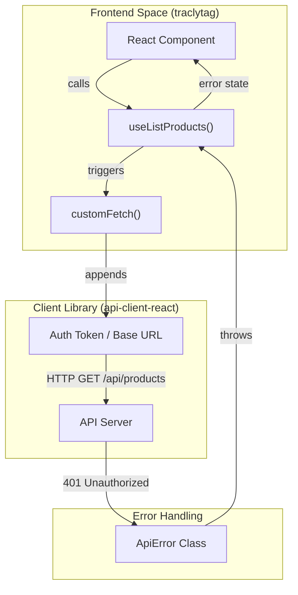
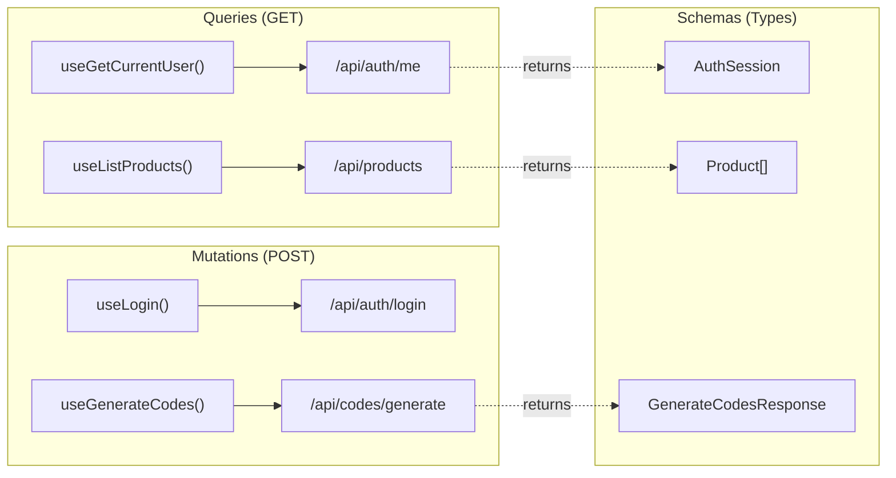

# React Query API Client (api-client-react)

<details>
<summary>Relevant source files</summary>

The following files were used as context for generating this wiki page:

- [lib/api-client-react/src/generated/api.schemas.ts](lib/api-client-react/src/generated/api.schemas.ts)
- [lib/api-client-react/src/generated/api.ts](lib/api-client-react/src/generated/api.ts)

</details>


The `@workspace/api-client-react` package provides a type-safe interface for the TraclyTag frontend to interact with the backend API. It leverages **TanStack Query (React Query)** for state management, caching, and data synchronization, and is automatically generated from the OpenAPI specification defined in `api-spec`.

## Overview and Purpose

This package serves as the bridge between the frontend application (`traclytag`) and the backend API server. By generating hooks directly from the OpenAPI schema, it ensures that the frontend remains in sync with API changes, providing full TypeScript IntelliSense for request bodies, query parameters, and response structures.

### Key Components
*   **Generated Hooks**: Custom React hooks (e.g., `useListProducts`, `useLogin`) for every API endpoint.
*   **Custom Fetch Utility**: A wrapper around the native `fetch` API that handles base URLs, authentication headers, and error parsing.
*   **Type Definitions**: TypeScript interfaces for all API entities (Products, Batches, Codes, etc.) generated from the schema.

Sources: [lib/api-client-react/src/generated/api.ts:1-54](), [lib/api-client-react/src/generated/api.schemas.ts:1-7]()

---

## Architecture and Data Flow

The client operates on a "Contract-First" principle. The OpenAPI YAML file is processed by **Orval** to produce the React Query hooks and schema types.

### API Client Data Flow
"The following diagram illustrates how a frontend component initiates a request using a generated hook, which passes through the custom fetch utility to the backend."


Sources: [lib/api-client-react/src/generated/api.ts:127-137](), [lib/api-client-react/src/custom-fetch.ts:40-65]()

---

## Custom Fetch Utility (`custom-fetch.ts`)

The `customFetch` function is the core execution engine for all API requests. It handles global configuration such as the base URL and authentication tokens.

### Configuration Functions
*   **`setBaseUrl(url: string)`**: Sets the target API server address (e.g., `https://api.traclytag.com`).
*   **`setAuthTokenGetter(fn: () => string | null)`**: Registers a callback that the client calls before every request to retrieve the current session token (usually from `localStorage`).

### Error Handling: `ApiError`
When the backend returns a non-2xx status code, the client throws an `ApiError` instance. This class captures the HTTP status and the JSON error body (typically matching the `ErrorResponse` schema).

| Feature | Code Entity | Description |
| :--- | :--- | :--- |
| **Base URL** | `baseUrl` | Global variable updated via `setBaseUrl`. |
| **Auth Token** | `authTokenGetter` | Callback for dynamic token injection. |
| **Error Class** | `ApiError` | Extends `Error` to include `status` and `data`. |

Sources: [lib/api-client-react/src/custom-fetch.ts:1-35](), [lib/api-client-react/src/generated/api.schemas.ts:12-14]()

---

## Generated Hooks and Schemas

The package provides two primary generated files: `api.ts` (hooks) and `api.schemas.ts` (types).

### 1. Data Models (`api.schemas.ts`)
This file contains interfaces for all entities in the system.
*   **`Product`**: Defines the packaging hierarchy (`l1Size`, `l2Size`, `shipperSize`) and GS1 attributes (`gtin`). [lib/api-client-react/src/generated/api.schemas.ts:95-122]()
*   **`Code`**: Represents a generated GS1 code, including its `rawString` and mapping status. [lib/api-client-react/src/generated/api.schemas.ts:199-238]()
*   **`Role`**: A constant object defining `master`, `client_admin`, and `operator`. [lib/api-client-react/src/generated/api.schemas.ts:19-23]()

### 2. React Query Hooks (`api.ts`)
Hooks are divided into Queries (GET requests) and Mutations (POST/PUT/DELETE).

#### Example: Fetching Data (Queries)
`useGetCurrentUser` is used to validate the session on app load.
`useListProducts` supports filtering and pagination via `ListProductsParams`.

#### Example: Modifying Data (Mutations)
`useGenerateCodes` is used to create new serial numbers for a specific batch.

### Code-to-Entity Mapping
"The following diagram maps the generated React hooks to their corresponding API endpoints and data schemas."


Sources: [lib/api-client-react/src/generated/api.ts:156-215](), [lib/api-client-react/src/generated/api.ts:320-360](), [lib/api-client-react/src/generated/api.schemas.ts:41-50](), [lib/api-client-react/src/generated/api.schemas.ts:250-253]()

---

## Frontend Consumption

The `traclytag` frontend consumes these hooks to manage server state. Because the hooks are integrated with TanStack Query, they provide built-in `isLoading`, `isError`, and `data` properties.

### Integration Example
When a user logs in, the frontend calls `useLogin`. On success, the application typically calls `setAuthTokenGetter` to ensure subsequent requests (like `useGetCurrentUser`) are authenticated.

```typescript
// Conceptual usage in traclytag
const { mutate: login, isLoading } = useLogin({
  mutation: {
    onSuccess: (session) => {
      // session is of type AuthSession
      console.log("Logged in as:", session.username);
    }
  }
});
```

Sources: [lib/api-client-react/src/generated/api.ts:205-215](), [lib/api-client-react/src/custom-fetch.ts:10-12]()

---
