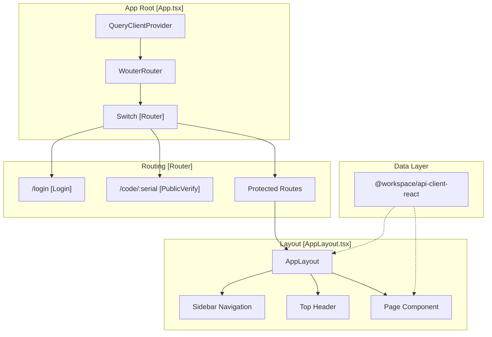
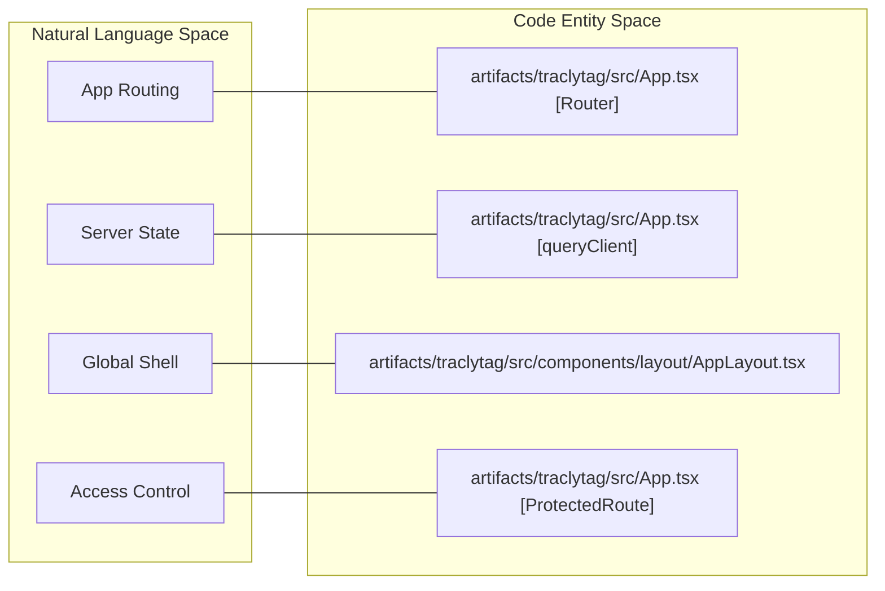

# Frontend Application (traclytag)

Relevant source files

The following files were used as context for generating this wiki page:

- [artifacts/traclytag/.gitignore](artifacts/traclytag/.gitignore)
- [artifacts/traclytag/src/App.tsx](artifacts/traclytag/src/App.tsx)
- [artifacts/traclytag/src/components/layout/AppLayout.tsx](artifacts/traclytag/src/components/layout/AppLayout.tsx)
- [artifacts/traclytag/src/index.css](artifacts/traclytag/src/index.css)
- [artifacts/traclytag/src/pages/companies.tsx](artifacts/traclytag/src/pages/companies.tsx)
- [artifacts/traclytag/src/pages/customer-scan.tsx](artifacts/traclytag/src/pages/customer-scan.tsx)
- [artifacts/traclytag/vite.config.ts](artifacts/traclytag/vite.config.ts)

The `traclytag` application is a modern React-based Single Page Application (SPA) that serves as the primary interface for the TraclyTag platform. It provides a comprehensive suite of tools for managing product master data, manufacturing batches, GS1 code generation, and supply chain reporting. The application is built with performance and developer experience in mind, utilizing Vite for bundling and a type-safe communication layer with the backend.

## Technical Architecture

The frontend is built on a robust stack that emphasizes type safety and component reusability. It consumes the shared `@workspace/api-client-react` package to interact with the backend API via generated TanStack Query hooks.

### Core Technology Stack

| Technology | Usage |
|:---|:---|
| **React** | Component-based UI library. |
| **Vite** | Build tool and development server [artifacts/traclytag/vite.config.ts:1-19](). |
| **Wouter** | Lightweight routing for the SPA [artifacts/traclytag/src/App.tsx:1-1](). |
| **TanStack Query** | Server state management and data fetching [artifacts/traclytag/src/App.tsx:2-2](). |
| **Tailwind CSS** | Utility-first styling with a custom "Industrial Calm" theme [artifacts/traclytag/src/index.css:7-64](). |
| **Radix UI / shadcn** | Accessible, unstyled primitives and pre-built UI components. |

### Routing and State
The application uses `wouter` for routing, with a central `Router` component defining both public and protected routes [artifacts/traclytag/src/App.tsx:76-101](). Global state is managed through `QueryClientProvider`, which handles caching and synchronization with the API [artifacts/traclytag/src/App.tsx:103-114]().

### Application Shell and Navigation
The `AppLayout` component provides the persistent navigation sidebar and header. It features role-based access control (RBAC), dynamically showing or hiding links based on the user's role (e.g., the "Companies" link is restricted to the `master` role) [artifacts/traclytag/src/components/layout/AppLayout.tsx:33-47]().

**Component Hierarchy and Data Flow**

Sources: [artifacts/traclytag/src/App.tsx:103-114](), [artifacts/traclytag/src/components/layout/AppLayout.tsx:16-47]().

## Feature Areas

The application is divided into several logical modules, each handling a specific part of the product lifecycle or administrative task.

### Authentication and Access Control
The frontend implements a multi-faceted authentication system. This includes standard password-based entry, WebAuthn/Passkey support, and a unique Device Authorization Grant flow for industrial hardware activation. For details, see [Authentication UI and Login Flows](#6.1).

### Master Data and Production
Users manage the core entities of the system through the Products and Batches interfaces. These pages handle GTIN validation, packaging hierarchies (e.g., Shipper vs. Unit), and the initialization of manufacturing runs. For details, see [Product Master and Batch Management UI](#6.2).

### Code Lifecycle and Verification
This module covers the generation of GS1-compliant serial numbers and SSCCs, mapping physical QR codes to digital identities, and the public-facing verification portal for end consumers. For details, see [Code Generation, Mapping, and Verification UI](#6.3).

### Analytics and Administration
The administrative interface provides a high-level Dashboard for KPIs, detailed Stock and Product reports, and multi-tenant management tools for `master` users to manage tenant companies. For details, see [Dashboard, Reports, and Administrative Pages](#6.4).

## Code-to-System Mapping

The following diagram maps high-level frontend concepts to their specific implementations in the codebase.

**System to Code Entity Mapping**

Sources: [artifacts/traclytag/src/App.tsx:32-101](), [artifacts/traclytag/src/components/layout/AppLayout.tsx:16-129]().

## UI Components and Styling
The UI follows an "Industrial Calm" design system defined in `index.css`. It uses CSS variables for theme-switching (Light/Dark) and standardized spacing/shadows [artifacts/traclytag/src/index.css:67-204](). Components are built using `shadcn/ui` patterns, often combining Radix UI primitives with Tailwind styling for consistency and accessibility.

Sources: [artifacts/traclytag/src/index.css:1-214](), [artifacts/traclytag/src/App.tsx:3-4]().

---
