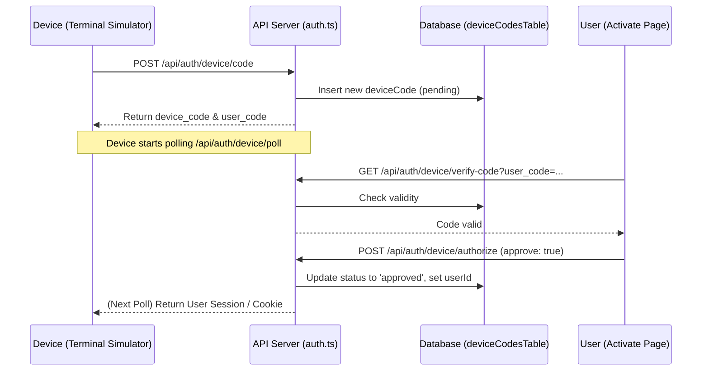
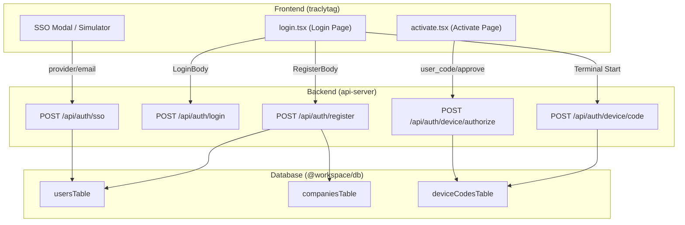

# Authentication UI and Login Flows

Relevant source files

The following files were used as context for generating this wiki page:

- [artifacts/api-server/src/routes/auth.ts](artifacts/api-server/src/routes/auth.ts)
- [artifacts/traclytag/src/components/ui/demo.tsx](artifacts/traclytag/src/components/ui/demo.tsx)
- [artifacts/traclytag/src/components/ui/login-form.tsx](artifacts/traclytag/src/components/ui/login-form.tsx)
- [artifacts/traclytag/src/components/ui/login.tsx](artifacts/traclytag/src/components/ui/login.tsx)
- [artifacts/traclytag/src/pages/activate.tsx](artifacts/traclytag/src/pages/activate.tsx)
- [artifacts/traclytag/src/pages/login.tsx](artifacts/traclytag/src/pages/login.tsx)

The TraclyTag authentication system provides a multi-modal entry point for users, supporting traditional credentials, Single Sign-On (SSO), WebAuthn (Passkeys), and the OAuth2 Device Authorization Grant. The frontend is built as a centralized `Login` component that manages complex state transitions between these various authentication methods.

## Login and Registration Forms

The primary authentication interface is located in `artifacts/traclytag/src/pages/login.tsx`. It uses `react-hook-form` with `zod` for client-side validation [artifacts/traclytag/src/pages/login.tsx:81-102]().

### Data Structures
- **Login Schema**: Requires `username` and `password`, with an optional `location` string captured during the flow [artifacts/traclytag/src/pages/login.tsx:31-35]().
- **Registration Schema**: Captures user details (`username`, `email`, `password`) and company metadata (`companyName`, `companyEmail`, `companyWebsiteUrl`) [artifacts/traclytag/src/pages/login.tsx:37-46]().

### Implementation Details
When a user registers, the backend `POST /api/auth/register` performs an atomic operation: it creates a new entry in the `companiesTable`, then creates a user in the `usersTable` with the `client_admin` role, linked to that company [artifacts/api-server/src/routes/auth.ts:10-60](). Passwords are hashed using `bcrypt` with a cost factor of 10 [artifacts/api-server/src/routes/auth.ts:47]().

**Sources:**
- [artifacts/traclytag/src/pages/login.tsx:31-102]()
- [artifacts/api-server/src/routes/auth.ts:10-60]()

## Geolocation Capture

The application attempts to capture the user's physical location during login or registration to provide audit trails.

1.  **Browser API**: It uses `navigator.geolocation.getCurrentPosition` [artifacts/traclytag/src/pages/login.tsx:138-140]().
2.  **Reverse Geocoding**: The coordinates are sent to the Nominatim OpenStreetMap API to retrieve a human-readable address [artifacts/traclytag/src/pages/login.tsx:145-156]().
3.  **Fallback**: If geocoding fails or is unavailable, the raw latitude/longitude coordinates are stored in the form's `location` field [artifacts/traclytag/src/pages/login.tsx:166-181]().

**Sources:**
- [artifacts/traclytag/src/pages/login.tsx:129-195]()

## SSO Mock Identity Provider

TraclyTag includes a mock SSO flow to simulate integration with providers like Google, GitHub, and Microsoft.

- **UI Trigger**: Users select a provider which opens a mock identity modal [artifacts/traclytag/src/pages/login.tsx:56-60]().
- **Backend Flow**: The `POST /api/auth/sso` endpoint handles the logic. If the SSO user does not exist, the system automatically creates a new company and a `client_admin` user for them [artifacts/api-server/src/routes/auth.ts:173-238]().
- **Session**: Upon successful mock validation, a signed `connect.sid` cookie is issued [artifacts/api-server/src/routes/auth.ts:250-257]().

**Sources:**
- [artifacts/traclytag/src/pages/login.tsx:55-61]()
- [artifacts/api-server/src/routes/auth.ts:173-260]()

## WebAuthn and Passkey Flow

The system supports passwordless authentication using the WebAuthn standard. Because environment constraints often hinder local WebAuthn testing, the UI includes a **Passkey Simulator**.

### Logic Flow: Registration
1.  User initiates passkey registration.
2.  Frontend calls `POST /api/auth/passkey/register-options` to get challenges from the server.
3.  The simulator mimics the `navigator.credentials.create` call.
4.  Frontend calls `POST /api/auth/passkey/verify-registration` with the credential data to store the public key in the `passkeysTable`.

### Logic Flow: Login
1.  User enters username and requests login options via `POST /api/auth/passkey/login-options`.
2.  The simulator mimics `navigator.credentials.get`.
3.  Verification is completed via `POST /api/auth/passkey/verify-login`, which validates the signature against the stored public key.

**Sources:**
- [artifacts/traclytag/src/pages/login.tsx:62-69]()
- [artifacts/api-server/src/routes/auth.ts:4]() (Schema reference)

## Device Authorization Grant (Device Flow)

This flow allows input-constrained devices (simulated as a terminal in the UI) to gain access by having a user approve the request on another device.

### Terminal Simulator
The Login page contains a terminal simulator that visualizes the device-side of the OAuth2 Device Flow:
- **Initialization**: The "device" calls `/api/auth/device/code` to receive a `device_code` and a 8-character `user_code` [artifacts/traclytag/src/pages/login.tsx:70-79]().
- **Polling**: The simulator starts polling `/api/auth/device/poll` every few seconds to check if the user has authorized the code [artifacts/traclytag/src/pages/login.tsx:111-117]().

### Activation Page
The `Activate` page (`artifacts/traclytag/src/pages/activate.tsx`) is the user-facing side of this flow:
1.  **Verification**: User enters the `user_code` shown on the terminal. The page calls `GET /api/auth/device/verify-code` [artifacts/traclytag/src/pages/activate.tsx:55-64]().
2.  **Authorization**: User clicks "Approve", triggering `POST /api/auth/device/authorize` which updates the status in the `deviceCodesTable` to 'approved' and links it to the current user's ID [artifacts/traclytag/src/pages/activate.tsx:76-89]().

### Device Flow Data Interaction
Title: Device Authorization Grant Sequence

**Sources:**
- [artifacts/traclytag/src/pages/login.tsx:70-79]()
- [artifacts/traclytag/src/pages/activate.tsx:46-99]()
- [artifacts/api-server/src/routes/auth.ts:4]()

## Code Entity Mapping

The following diagram maps the UI states and actions to the corresponding backend route handlers and database entities.

Title: Authentication Code Entity Mapping

**Sources:**
- [artifacts/traclytag/src/pages/login.tsx:31-102]()
- [artifacts/traclytag/src/pages/activate.tsx:76-80]()
- [artifacts/api-server/src/routes/auth.ts:10-142]()
- [artifacts/api-server/src/routes/auth.ts:173-240]()

---
