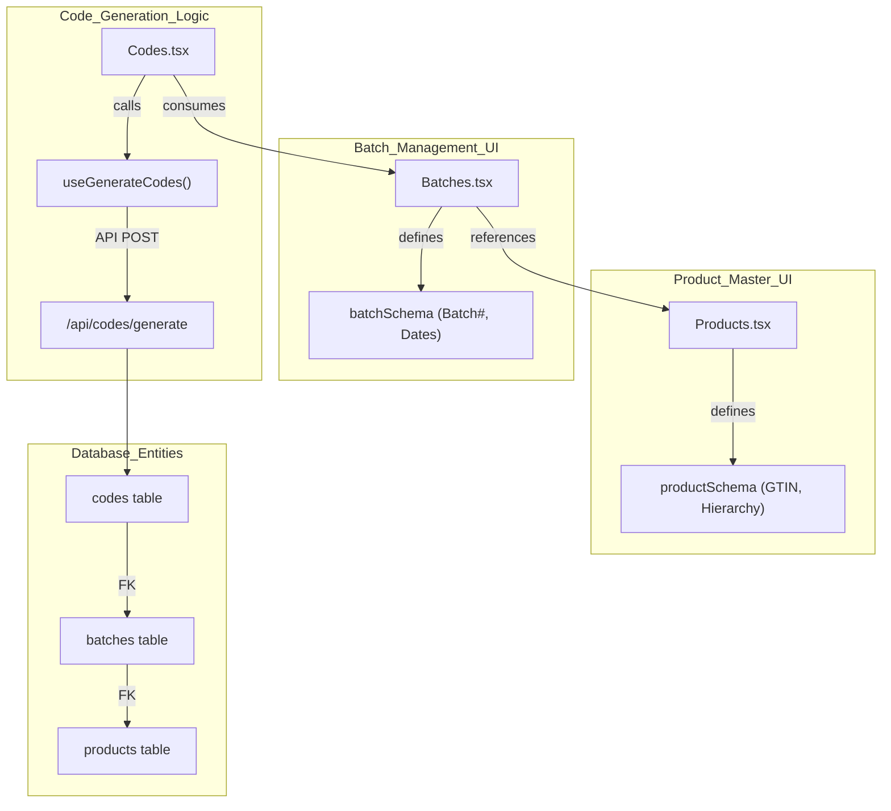
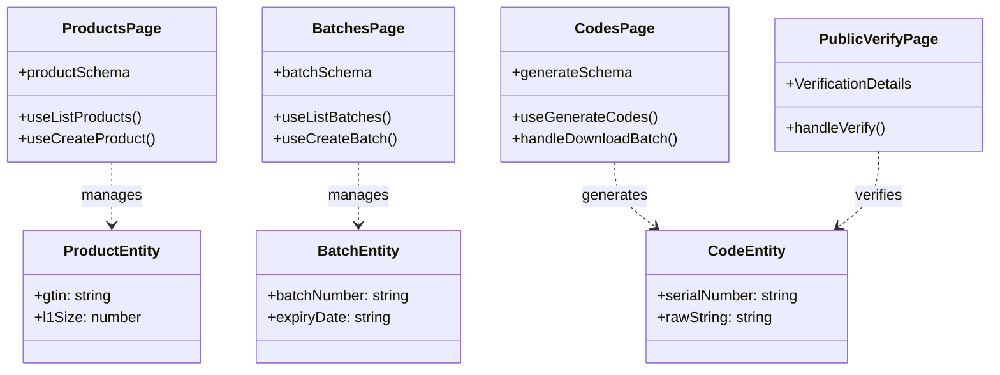

# Product Master and Batch Management UI

Relevant source files

The following files were used as context for generating this wiki page:

- [artifacts/traclytag/src/pages/production/batches.tsx](artifacts/traclytag/src/pages/production/batches.tsx)
- [artifacts/traclytag/src/pages/production/codes.tsx](artifacts/traclytag/src/pages/production/codes.tsx)
- [artifacts/traclytag/src/pages/products.tsx](artifacts/traclytag/src/pages/products.tsx)
- [artifacts/traclytag/src/pages/public-verify.tsx](artifacts/traclytag/src/pages/public-verify.tsx)
- [lib/db/traclytag.db](lib/db/traclytag.db)

This page documents the frontend implementation of the Product Master and Batch Management modules. These interfaces allow users to define product specifications (GTINs, packaging hierarchies, and assets) and organize manufacturing runs into batches for serialization.

## Product Master

The Products page provides a centralized registry for all trade items. It enforces GS1 standards for GTINs and defines the parent-child relationships used during the aggregation process (Unit → L1 → L2 → Shipper).

### Product Schema and Validation
Product creation is governed by a strict Zod schema `productSchema` defined in [artifacts/traclytag/src/pages/products.tsx:62-87](). Key validation rules include:
*   **GTIN**: Must be exactly 13 or 14 digits [artifacts/traclytag/src/pages/products.tsx:68-68]().
*   **Packaging Hierarchy**: Requires integer values for `l1Size`, `l2Size`, and `shipperSize` to determine how many child units belong to each parent level [artifacts/traclytag/src/pages/products.tsx:71-73]().
*   **Asset URLs**: Validates that logos and PDF labels are provided as valid URLs [artifacts/traclytag/src/pages/products.tsx:74-84]().

### Asset Management and Uploads
The UI supports direct file uploads for product logos and caution labels. The `handleUpload` function [artifacts/traclytag/src/pages/products.tsx:117-156]() performs the following:
1.  Creates a dynamic file input with specific MIME type filters (`.pdf` for labels, `image/*` for logos) [artifacts/traclytag/src/pages/products.tsx:120-124]().
2.  POSTs the file to `/api/upload` [artifacts/traclytag/src/pages/products.tsx:135-138]().
3.  Converts the returned relative path into an absolute URL using `window.location.origin` and updates the form state [artifacts/traclytag/src/pages/products.tsx:146-147]().

### RBAC Filtering
The interface adapts based on the user's role:
*   **Master Users**: Can view and assign products to specific companies via a company selection dropdown [artifacts/traclytag/src/pages/products.tsx:93-94]().
*   **Tenant Users**: Are restricted to products belonging to their own `companyId` (handled by the backend API and filtered in the UI) [artifacts/traclytag/src/pages/products.tsx:183-183]().

**Sources:**
* [artifacts/traclytag/src/pages/products.tsx:62-87]() (Schema)
* [artifacts/traclytag/src/pages/products.tsx:117-156]() (Upload Logic)
* [lib/db/traclytag.db:9-28]() (Database Schema Reference)

---

## Batch Management

The Batches page manages manufacturing runs. A batch is a temporal instance of a product, required for generating GS1-compliant serial numbers that include manufacturing and expiry dates.

### Batch Creation Workflow
Users create batches by associating a unique `batchNumber` with an existing product [artifacts/traclytag/src/pages/production/batches.tsx:23-28]().
*   **Date Management**: The UI utilizes `date-fns` to format `mfgDate` and `expiryDate` into ISO strings (`yyyy-MM-dd`) before submission to the API [artifacts/traclytag/src/pages/production/batches.tsx:55-56]().
*   **Unique Constraints**: The system prevents duplicate batch numbers for the same product [lib/db/traclytag.db:47-47]().

### Batch-to-Code Pipeline
Once a batch is registered, it becomes available in the **Codes** generation interface [artifacts/traclytag/src/pages/production/codes.tsx:36-36](). The relationship is as follows:
1.  **Product Selection**: Defines the GTIN.
2.  **Batch Selection**: Defines the Batch Number and Expiry.
3.  **Level Selection**: Determines if the system generates Serial Numbers (Unit/L1/L2) or SSCC codes (Shipper/Pallet) [artifacts/traclytag/src/pages/production/codes.tsx:37-37]().

### Code Generation Data Flow
The following diagram illustrates the transition from a Product/Batch definition to generated GS1 codes.

**Diagram: Batch-to-Code Generation Pipeline**

**Sources:**
* [artifacts/traclytag/src/pages/production/batches.tsx:23-28]() (Batch Schema)
* [artifacts/traclytag/src/pages/production/codes.tsx:34-39]() (Code Generation Schema)
* [lib/db/traclytag.db:29-47]() (Database Table Relationships)

---

## Code Export and Registry

The Codes page [artifacts/traclytag/src/pages/production/codes.tsx]() serves as the registry for all generated identifiers.

### CSV Export Implementation
The UI provides two types of exports:
1.  **Batch Export**: Downloads all codes for a specific batch. It fetches data from `/api/codes?batchId={id}` and constructs a CSV blob in the browser [artifacts/traclytag/src/pages/production/codes.tsx:80-121]().
2.  **Summary Report**: Exports the current filtered view of the product report table [artifacts/traclytag/src/pages/production/codes.tsx:124-150]().

### Verification Interface
The `PublicVerify` page [artifacts/traclytag/src/pages/public-verify.tsx]() provides the consumer-facing side of the batch management system.
*   It accepts a serial number via URL parameter [artifacts/traclytag/src/pages/public-verify.tsx:39-39]().
*   It calls the public verification endpoint `/api/codes/public/:serial` [artifacts/traclytag/src/pages/public-verify.tsx:62-62]().
*   It displays batch details (Mfg Date, Expiry, Batch Number) and product metadata to the user upon successful verification [artifacts/traclytag/src/pages/public-verify.tsx:11-36]().

**Diagram: UI to API Entity Mapping**

**Sources:**
* [artifacts/traclytag/src/pages/production/codes.tsx:80-121]() (CSV Logic)
* [artifacts/traclytag/src/pages/public-verify.tsx:62-81]() (Verification Logic)
* [artifacts/traclytag/src/pages/public-verify.tsx:11-36]() (Verification Interface)

---
