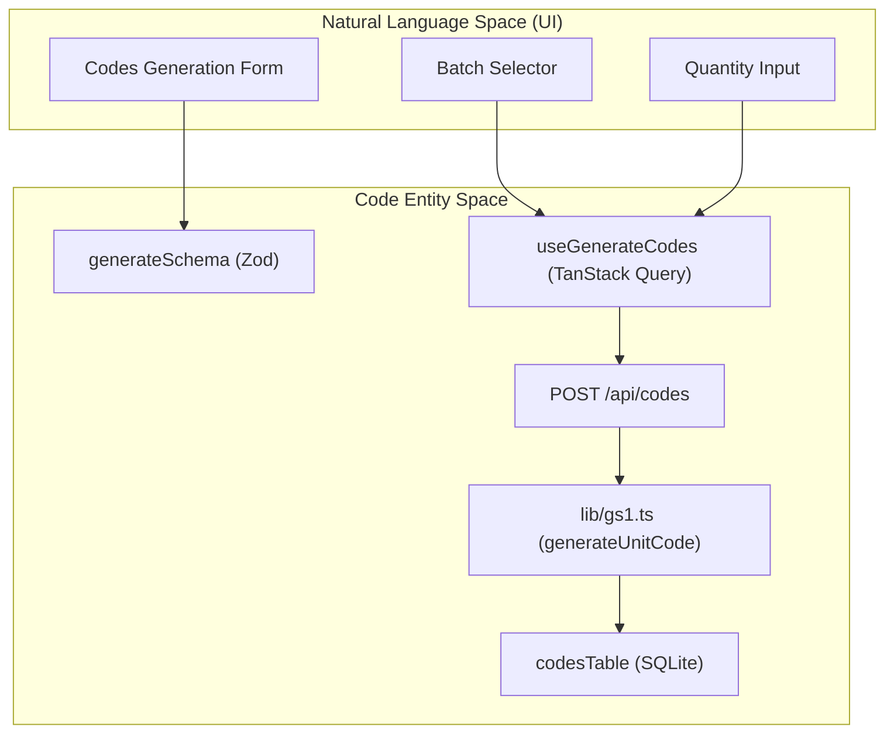
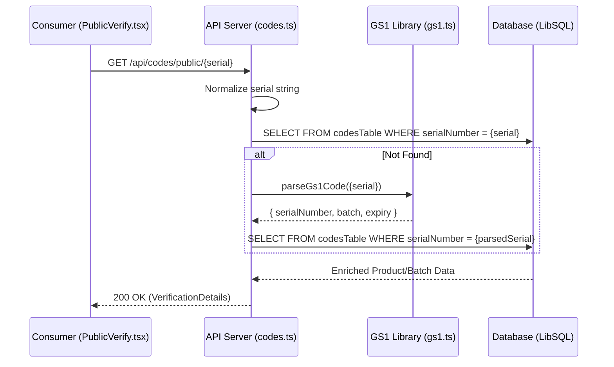

# Code Generation, Mapping, and Verification UI

Relevant source files

The following files were used as context for generating this wiki page:

- [artifacts/api-server/src/routes/codes.ts](artifacts/api-server/src/routes/codes.ts)
- [artifacts/traclytag/src/pages/mapping-code.tsx](artifacts/traclytag/src/pages/mapping-code.tsx)
- [artifacts/traclytag/src/pages/production/batches.tsx](artifacts/traclytag/src/pages/production/batches.tsx)
- [artifacts/traclytag/src/pages/production/codes.tsx](artifacts/traclytag/src/pages/production/codes.tsx)
- [artifacts/traclytag/src/pages/public-verify.tsx](artifacts/traclytag/src/pages/public-verify.tsx)

This section covers the end-to-end lifecycle of serialization codes within the TraclyTag system, from administrative generation and bulk export to real-time mapping on the production line and final consumer verification.

## 1. Code Generation and Batch Registry

The generation interface allows administrators to create GS1-compliant serial numbers or SSCC codes linked to specific production batches. 

### Implementation Details
- **Form Validation**: The `generateSchema` enforces a minimum quantity of 1 and a maximum of 5,000 units per request [artifacts/traclytag/src/pages/production/codes.tsx:34-39]().
- **Data Flow**: The frontend utilizes the `useGenerateCodes` hook [artifacts/traclytag/src/pages/production/codes.tsx:57](), which calls the backend `POST /api/codes` endpoint.
- **CSV Export**: Users can download generated codes for a specific batch. The system fetches the full list (up to 5,000) and constructs a CSV blob containing the Serial Number/SSCC, Level, and Raw GS1 String [artifacts/traclytag/src/pages/production/codes.tsx:80-121]().

### Code Generation Logic
The backend uses a specialized GS1 library to ensure standard compliance:
- **Unit Levels**: Uses `generateUnitCode` to combine GTIN, Expiry, Batch, and a unique Serial [artifacts/api-server/src/routes/codes.ts:14]().
- **Logistics Levels**: Uses `generateSsccCode` for Pallet and Shipper levels [artifacts/api-server/src/routes/codes.ts:14]().

**Entity Mapping: Generation Flow**
The following diagram illustrates the transition from user input in the UI to the persistence of GS1 entities in the database.

Sources: [artifacts/traclytag/src/pages/production/codes.tsx:34-39](), [artifacts/api-server/src/routes/codes.ts:1-14](), [artifacts/traclytag/src/pages/production/codes.tsx:158-172]()

---

## 2. Mapping Code Dashboard

The Mapping Code module provides visibility into the "activation" of codes. A code is considered "mapped" when it is physically associated with a product unit on the production line.

### Key Features
- **Efficiency Tracking**: Calculates the percentage of mapped codes vs. total generated codes per batch [artifacts/traclytag/src/pages/mapping-code.tsx:15-17]().
- **Status Indicators**: Visual cues (Success/Warning) based on the remaining unmapped QR codes [artifacts/traclytag/src/pages/mapping-code.tsx:144-149]().
- **Filtering**: Allows searching by `productName` or `batchNumber` to audit specific production runs [artifacts/traclytag/src/pages/mapping-code.tsx:80-119]().

### Data Structure
The mapping view aggregates data from the `codesTable` joined with `batchesTable` and `productsTable`. It tracks:
- `totalQR`: Count of all codes for a batch.
- `mappedQR`: Count of codes where `mapped` is true.
- `remainingQR`: `totalQR` - `mappedQR`.

Sources: [artifacts/traclytag/src/pages/mapping-code.tsx:7-58](), [artifacts/api-server/src/routes/codes.ts:182-200]()

---

## 3. Public Verification (PublicVerify)

The `PublicVerify` page is a public-facing route (`/verify/:serial`) that allows consumers to check product authenticity without an account.

### Verification Process
1. **User Data Collection**: Before showing results, the UI requests consumer details (Full Name, Mobile, Zip Code) and location access [artifacts/traclytag/src/pages/public-verify.tsx:48-51]().
2. **Cryptographic Lookup**: The frontend calls `GET /api/codes/public/:serial` [artifacts/traclytag/src/pages/public-verify.tsx:62]().
3. **Normalization**: The backend trims whitespace and handles scanner prefixes (e.g., removing `::`) [artifacts/api-server/src/routes/codes.ts:102-106]().
4. **Multi-Strategy Search**:
    - **Direct Lookup**: Matches against `serialNumber` or `ssccCode` [artifacts/api-server/src/routes/codes.ts:111-116]().
    - **Raw Match**: Matches the full GS1 string [artifacts/api-server/src/routes/codes.ts:125-130]().
    - **GS1 Parsing**: Uses `parseGs1Code` to extract identifiers from complex barcode strings [artifacts/api-server/src/routes/codes.ts:133-143]().

### Data Flow: Public Verification

Sources: [artifacts/api-server/src/routes/codes.ts:51-178](), [artifacts/traclytag/src/pages/public-verify.tsx:62-81]()

---

## 4. Technical Reference

### Key Components & Functions

| Component/Function | File Path | Description |
|:---|:---|:---|
| `PublicVerify` | [artifacts/traclytag/src/pages/public-verify.tsx:38]() | React component for the consumer authenticity check page. |
| `Codes` | [artifacts/traclytag/src/pages/production/codes.tsx:41]() | Management UI for generating and exporting batch codes. |
| `fetchEnrichedCodes` | [artifacts/api-server/src/routes/codes.ts:182]() | Backend helper to join codes with product and batch metadata. |
| `generateSchema` | [artifacts/traclytag/src/pages/production/codes.tsx:34]() | Zod validation for the code generation request. |
| `handleDownloadBatch` | [artifacts/traclytag/src/pages/production/codes.tsx:80]() | Client-side logic for generating CSV files from API responses. |

### Database Interaction
The system uses Drizzle ORM to perform "enriched" queries. When a code is verified, the system joins the `codesTable` with:
- `productsTable`: For GTIN, name, and marketing info [artifacts/api-server/src/routes/codes.ts:93]().
- `batchesTable`: For manufacturing and expiry dates [artifacts/api-server/src/routes/codes.ts:94]().
- `companiesTable`: For brand owner details [artifacts/api-server/src/routes/codes.ts:97]().

Sources: [artifacts/api-server/src/routes/codes.ts:82-99](), [artifacts/traclytag/src/pages/production/codes.tsx:1-40]()

---
