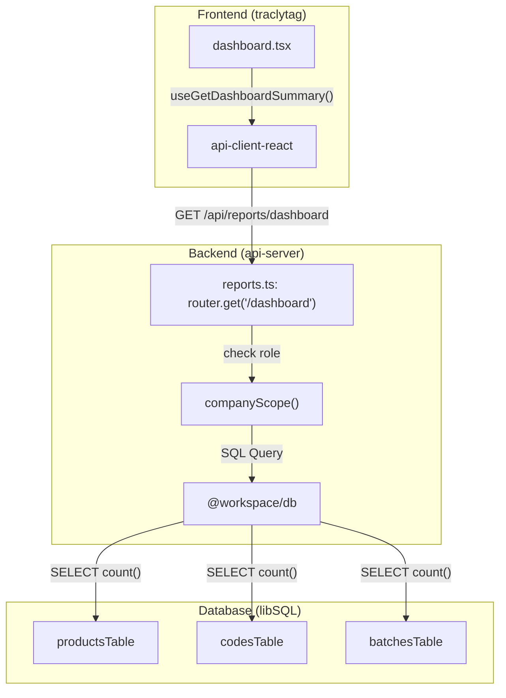
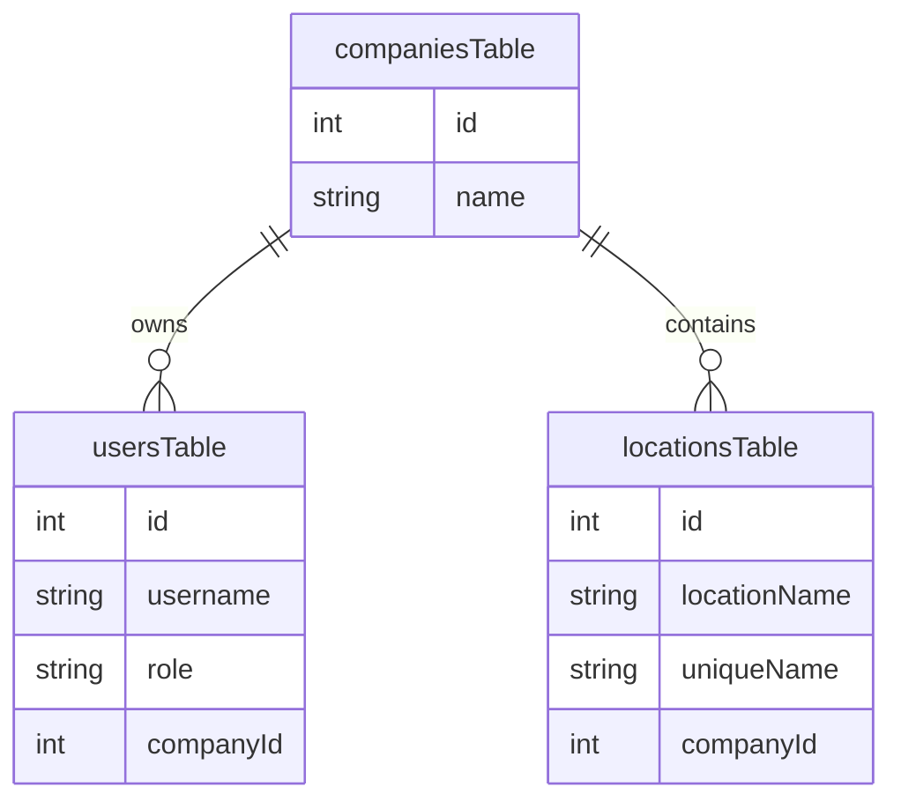

# Dashboard, Reports, and Administrative Pages

Relevant source files

The following files were used as context for generating this wiki page:

- [artifacts/api-server/src/routes/reports.ts](artifacts/api-server/src/routes/reports.ts)
- [artifacts/traclytag/src/pages/dashboard.tsx](artifacts/traclytag/src/pages/dashboard.tsx)
- [artifacts/traclytag/src/pages/locations.tsx](artifacts/traclytag/src/pages/locations.tsx)
- [artifacts/traclytag/src/pages/reports/marked-by.tsx](artifacts/traclytag/src/pages/reports/marked-by.tsx)
- [artifacts/traclytag/src/pages/reports/product.tsx](artifacts/traclytag/src/pages/reports/product.tsx)
- [artifacts/traclytag/src/pages/reports/stock.tsx](artifacts/traclytag/src/pages/reports/stock.tsx)
- [artifacts/traclytag/src/pages/settings.tsx](artifacts/traclytag/src/pages/settings.tsx)
- [artifacts/traclytag/src/pages/support.tsx](artifacts/traclytag/src/pages/support.tsx)
- [artifacts/traclytag/src/pages/users.tsx](artifacts/traclytag/src/pages/users.tsx)

This page documents the TraclyTag executive dashboard, the specialized reporting modules for inventory and audit trails, and the administrative interfaces used for system configuration and multi-tenant management.

## 1. Executive Dashboard

The Dashboard serves as the primary entry point for users, providing high-level KPIs and real-time visibility into the serialization pipeline.

### 1.1 Implementation and Data Flow
The dashboard consumes the `useGetDashboardSummary` hook from `@workspace/api-client-react` [artifacts/traclytag/src/pages/dashboard.tsx:16](), which calls the `/api/reports/dashboard` endpoint [artifacts/api-server/src/routes/reports.ts:41]().

**Key Metrics Aggregated:**
*   **Total Codes:** A count of all generated GS1 codes within the user's company scope [artifacts/api-server/src/routes/reports.ts:59-67]().
*   **Active Batches:** Count of manufacturing runs linked to the company [artifacts/api-server/src/routes/reports.ts:53-57]().
*   **Mapping Efficiency:** A breakdown of `mapped` vs `unmapped` codes using SQL case statements [artifacts/api-server/src/routes/reports.ts:62-63]().
*   **Recent Activity:** A table displaying the 10 most recently created codes, including their product name, batch number, and current mapping status [artifacts/api-server/src/routes/reports.ts:91-117]().

### 1.2 Multi-Tenant Scoping
The dashboard data is strictly filtered by the `companyScope` function [artifacts/api-server/src/routes/reports.ts:18-22](). If the requesting user has the `master` role, they see global aggregates; otherwise, queries are restricted to the user's `companyId` [artifacts/api-server/src/routes/reports.ts:48-50]().

**Dashboard Data Retrieval Flow**
Title: Dashboard Data Retrieval Flow

Sources: [artifacts/traclytag/src/pages/dashboard.tsx:14-32](), [artifacts/api-server/src/routes/reports.ts:18-141]()

---

## 2. Reporting Modules

TraclyTag provides three distinct report views to support logistics and compliance audits. All reports support CSV export via the `exportCsv` utility [artifacts/traclytag/src/pages/reports/product.tsx:8]().

### 2.1 Stock Report
The Stock Report tracks current inventory levels based on mapping status. It allows filtering by `productId` and date range [artifacts/traclytag/src/pages/reports/stock.tsx:14-21]().
*   **Logic:** Aggregates codes grouped by `productId` and `batchId` [artifacts/api-server/src/routes/reports.ts:158-173]().
*   **Metric:** Distinguishes between "Total Codes Generated" and "Mapped (In Stock)" [artifacts/traclytag/src/pages/reports/stock.tsx:77-78]().

### 2.2 Product Report
Provides a comprehensive breakdown of the packaging hierarchy and serialization progress.
*   **Hierarchy Detail:** Includes the `skuSize` (Pack Size Ref) from the `productsTable` [artifacts/api-server/src/routes/reports.ts:191]().
*   **Implementation:** Similar to the Stock Report but includes SKU-specific metadata for production planning [artifacts/traclytag/src/pages/reports/product.tsx:53-58]().

### 2.3 Marked-By Log (Audit Trail)
A live log of all code mapping activities, identifying which operator associated a physical GS1 code with a digital record.
*   **Data Join:** Joins `codesTable` with `usersTable` and `locationsTable` to provide a full context of the mapping event [artifacts/api-server/src/routes/reports.ts:91-114]().
*   **Timestamp Parsing:** Handles numeric strings and ISO dates to ensure consistent audit trail display [artifacts/traclytag/src/pages/reports/marked-by.tsx:11-18]().

Sources: [artifacts/traclytag/src/pages/reports/stock.tsx:13-32](), [artifacts/traclytag/src/pages/reports/product.tsx:12-26](), [artifacts/traclytag/src/pages/reports/marked-by.tsx:8-32](), [artifacts/api-server/src/routes/reports.ts:143-203]()

---

## 3. Administrative Pages

Administrative interfaces manage the organizational structure and access control.

### 3.1 User Management
The Users page allows administrators to create, delete, and manage roles (`master`, `client_admin`, `operator`) [artifacts/traclytag/src/pages/users.tsx:26]().
*   **Role Protection:** Users cannot delete their own accounts [artifacts/traclytag/src/pages/users.tsx:74-77]().
*   **Validation:** Uses `userSchema` (Zod) to enforce password length and email format [artifacts/traclytag/src/pages/users.tsx:21-28]().
*   **Master Admin View:** If the user is a `master`, they can assign new users to any `companyId` via a dropdown [artifacts/traclytag/src/pages/users.tsx:147-152]().

### 3.2 Facilities (Locations)
Manages physical nodes like warehouses and factories.
*   **Schema:** Captures `locationType`, `uniqueName` (e.g., WH-PUNE-01), and full address details [artifacts/traclytag/src/pages/locations.tsx:56-64]().
*   **State Management:** Uses `useQueryClient` to invalidate the `getListLocationsQueryKey` upon successful creation or deletion, ensuring the UI stays in sync with the backend [artifacts/traclytag/src/pages/locations.tsx:92-95]().

### 3.3 System Settings and Support
*   **Settings:** Currently serves as a placeholder for global configuration; modules are flagged as "offline for maintenance" in the UI [artifacts/traclytag/src/pages/settings.tsx:21]().
*   **Support:** Provides a contact point for industrial platform assistance [artifacts/traclytag/src/pages/support.tsx:21]().

**Administrative Entity Relationship**
Title: Administrative Entity Relationship

Sources: [artifacts/traclytag/src/pages/users.tsx:21-52](), [artifacts/traclytag/src/pages/locations.tsx:56-122](), [artifacts/traclytag/src/pages/settings.tsx:4-26](), [artifacts/traclytag/src/pages/support.tsx:4-26]()

---
