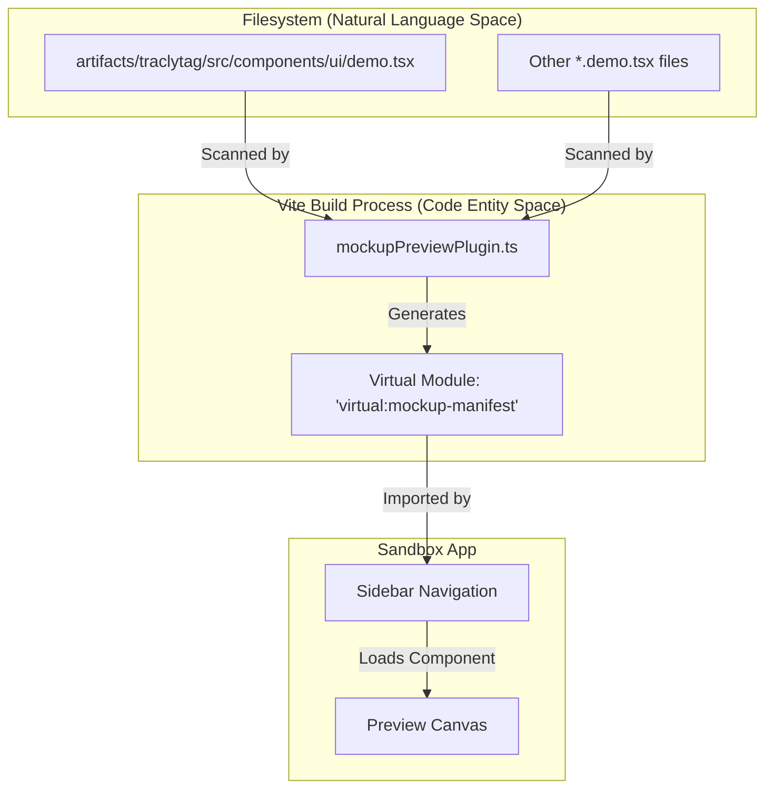
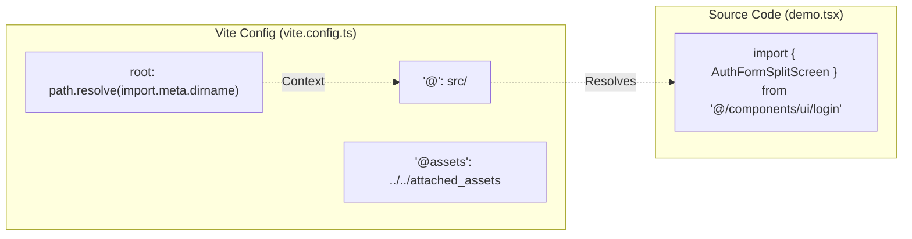

# Mockup Sandbox

Relevant source files

The following files were used as context for generating this wiki page:

- [artifacts/traclytag/src/components/ui/demo.tsx](artifacts/traclytag/src/components/ui/demo.tsx)
- [artifacts/traclytag/vite.config.ts](artifacts/traclytag/vite.config.ts)

The Mockup Sandbox is a dedicated Vite-based environment within the TraclyTag monorepo designed for rapid UI component development and previewing. It operates as an isolated workspace (`@workspace/mockup-sandbox`) that allows developers to iterate on complex UI designs—such as login screens, dashboards, and GS1 code management views—without the overhead of running the full backend API or navigating through application state.

### Purpose and Workflow

The sandbox serves as a "living style guide" and testing ground. By isolating components from the main application (`artifacts/traclytag`), developers can:
1.  **Simulate Edge Cases:** Test UI states (loading, error, empty) by passing mock data or using local state within "Demo" components [artifacts/traclytag/src/components/ui/demo.tsx:3-15]().
2.  **Rapid Prototyping:** Build new layouts using Tailwind CSS and Radix UI primitives before integrating them into the production routing system.
3.  **Visual Regression Testing:** Manually verify visual changes across different viewports and themes in a controlled environment.

---

### Auto-Discovery Mechanism

The sandbox relies on a custom Vite plugin, `mockupPreviewPlugin.ts`, which automates the discovery of previewable components. This plugin scans the filesystem for files following specific naming conventions (e.g., `*.demo.tsx` or components within a `demo/` directory) and dynamically generates a navigation manifest.

#### Data Flow: Component Discovery

The following diagram illustrates how the plugin bridges the filesystem to the Sandbox UI:

**Discovery and Registration Flow**

Sources: [artifacts/traclytag/src/components/ui/demo.tsx:1-31](), [artifacts/traclytag/vite.config.ts:16-35]()

---

### Implementation Details

#### Demo Components
A typical mockup component is a self-contained React function that wraps a production component with the necessary mock props and handlers. For instance, `AuthFormSplitScreenDemo` simulates the authentication UI by providing a mock `handleLogin` function that logs data to the console and simulates a network delay using a `sleep` utility [artifacts/traclytag/src/components/ui/demo.tsx:4-15]().

| Feature | Implementation in Mockup |
| :--- | :--- |
| **API Simulation** | Local `sleep` functions and `alert` calls [artifacts/traclytag/src/components/ui/demo.tsx:4-15]() |
| **Asset Loading** | Direct URL imports or aliased paths via `@assets` [artifacts/traclytag/vite.config.ts:39-40]() |
| **State Management** | Local `useState` or hardcoded props [artifacts/traclytag/src/components/ui/demo.tsx:18-29]() |

#### Configuration and Aliasing
The sandbox shares the same Vite configuration principles as the main application, ensuring that styles and path aliases remain consistent. The `@` alias points to the `src` directory of the frontend application, allowing the sandbox to import components directly from the production source [artifacts/traclytag/vite.config.ts:37-38]().

**Sandbox Configuration Mapping**

Sources: [artifacts/traclytag/vite.config.ts:36-43](), [artifacts/traclytag/src/components/ui/demo.tsx:1-1]()

---

### Usage in Development

To start the mockup sandbox, developers run the designated workspace script (typically `pnpm --filter @workspace/mockup-sandbox dev`). This launches a Vite server on a specific port (defaulting to `5173` or as defined by the `PORT` environment variable) [artifacts/traclytag/vite.config.ts:7-12]().

Unlike the main application, the sandbox server does not strictly require the backend API to be running, although the `proxy` configuration is often maintained to allow for hybrid testing where some components might still hit the `/api` endpoints [artifacts/traclytag/vite.config.ts:56-61]().

**Key Functions and Constants:**
*   `defineConfig`: Configures the Vite environment, including plugins like `@vitejs/plugin-react` and `tailwindcss` [artifacts/traclytag/vite.config.ts:16-20]().
*   `runtimeErrorOverlay`: Provides an immediate UI feedback loop within the sandbox for runtime exceptions [artifacts/traclytag/vite.config.ts:21-21]().
*   `sleep`: A utility within demo files used to mimic the asynchronous nature of the `api-client-react` hooks [artifacts/traclytag/src/components/ui/demo.tsx:4-4]().

Sources: [artifacts/traclytag/vite.config.ts:1-68](), [artifacts/traclytag/src/components/ui/demo.tsx:1-31]()

---
