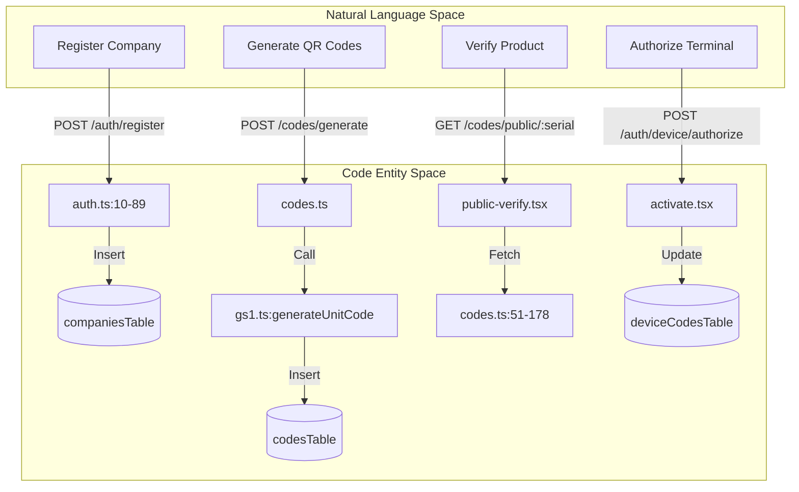
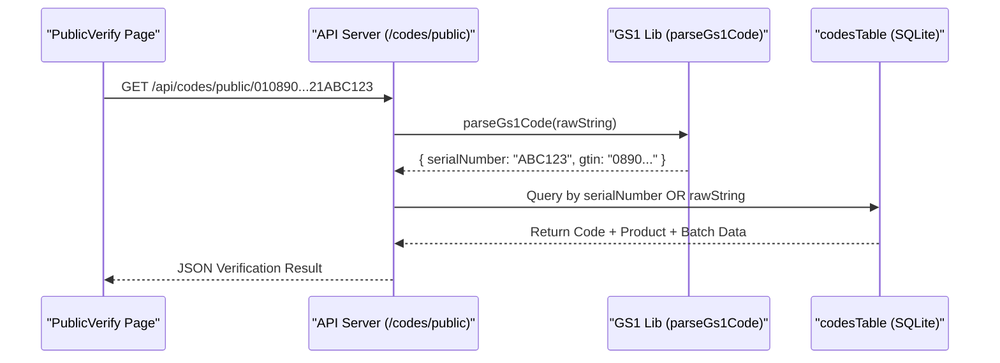

# Glossary

Relevant source files

The following files were used as context for generating this wiki page:

- [artifacts/api-server/src/app.ts](artifacts/api-server/src/app.ts)
- [artifacts/api-server/src/lib/gs1.ts](artifacts/api-server/src/lib/gs1.ts)
- [artifacts/api-server/src/middlewares/loadUser.ts](artifacts/api-server/src/middlewares/loadUser.ts)
- [artifacts/api-server/src/routes/auth.ts](artifacts/api-server/src/routes/auth.ts)
- [artifacts/api-server/src/routes/codes.ts](artifacts/api-server/src/routes/codes.ts)
- [artifacts/api-server/src/routes/index.ts](artifacts/api-server/src/routes/index.ts)
- [artifacts/api-server/src/routes/upload.ts](artifacts/api-server/src/routes/upload.ts)
- [artifacts/traclytag/src/pages/activate.tsx](artifacts/traclytag/src/pages/activate.tsx)
- [artifacts/traclytag/src/pages/production/batches.tsx](artifacts/traclytag/src/pages/production/batches.tsx)
- [artifacts/traclytag/src/pages/production/codes.tsx](artifacts/traclytag/src/pages/production/codes.tsx)
- [artifacts/traclytag/src/pages/products.tsx](artifacts/traclytag/src/pages/products.tsx)
- [artifacts/traclytag/src/pages/public-verify.tsx](artifacts/traclytag/src/pages/public-verify.tsx)
- [lib/api-zod/src/generated/types/codeLevel.ts](lib/api-zod/src/generated/types/codeLevel.ts)
- [lib/api-zod/src/generated/types/role.ts](lib/api-zod/src/generated/types/role.ts)
- [lib/db/src/index.ts](lib/db/src/index.ts)
- [lib/db/src/schema/index.ts](lib/db/src/schema/index.ts)
- [lib/db/traclytag.db](lib/db/traclytag.db)

This glossary defines technical terms, standards, and code entities used within the TraclyTag ecosystem. It serves as a reference for onboarding engineers to understand the relationship between GS1 supply chain standards and their specific implementation in the codebase.

## Core Concepts & GS1 Standards

### GS1 Identifiers
The system relies on the GS1 global standards for identifying products and logistics units.

*   **GTIN (Global Trade Item Number)**: A 13 or 14-digit number used to identify trade items. The system validates these using a check digit algorithm.
    *   **Implementation**: `isValidGtin` in [artifacts/api-server/src/lib/gs1.ts:15-21]().
*   **SSCC (Serial Shipping Container Code)**: An 18-digit number used to identify logistics units (e.g., Pallets, Shippers).
    *   **Implementation**: `generateSsccCode` in [artifacts/api-server/src/lib/gs1.ts:76-88]().
*   **AI (Application Identifier)**: Two or more digits at the beginning of a GS1 element string that define the format and meaning of the following data field.
    *   **Common AIs in TraclyTag**: `01` (GTIN), `17` (Expiry), `10` (Batch), `21` (Serial).
    *   **Logic**: Handled in `parseGs1Code` [artifacts/api-server/src/lib/gs1.ts:91-162]().
*   **FNC1 (Function 1 Symbol Character)**: A non-printable character used as a separator for variable-length GS1 fields.
    *   **Definition**: `String.fromCharCode(232)` [artifacts/api-server/src/lib/gs1.ts:3-3]().

### Packaging Hierarchy
TraclyTag tracks items across multiple levels of aggregation, defined in the `codeLevel` type [lib/api-zod/src/generated/types/codeLevel.ts]().

| Level | Description | Code Type |
| :--- | :--- | :--- |
| `unit` | Individual product item | GTIN + Serial |
| `l1` | Inner pack / Small bundle | GTIN + Serial |
| `l2` | Case / Intermediate pack | GTIN + Serial |
| `shipper` | Large shipping container | SSCC |
| `pallet` | Highest logistics level | SSCC |

---

## Technical Entities & Roles

### User Roles
Roles are defined in [lib/api-zod/src/generated/types/role.ts]() and enforced via middleware.

*   **Master**: Global system administrator with cross-tenant visibility.
*   **Client Admin**: Administrator for a specific company; can manage users and products within their tenant.
*   **Operator**: Factory-floor user responsible for batch creation and code generation.

### System Components Diagram: Natural Language to Code
This diagram maps high-level business actions to the specific code functions and database tables that execute them.

**Sources**: [artifacts/api-server/src/routes/auth.ts:10-89](), [artifacts/api-server/src/routes/codes.ts:51-178](), [artifacts/api-server/src/lib/gs1.ts:63-72](), [artifacts/traclytag/src/pages/activate.tsx:73-99]().

---

## Database Schema Glossary

The database is built on LibSQL/SQLite using Drizzle ORM [lib/db/src/index.ts:1-17]().

| Table Name | Description | Key File Pointer |
| :--- | :--- | :--- |
| `companies` | Multi-tenant root entities. | [lib/db/traclytag.db:76-82]() |
| `users` | System users with RBAC roles. | [lib/db/traclytag.db:66-76]() |
| `products` | Product masters including GTIN and packaging sizes (`l1_size`, etc). | [lib/db/traclytag.db:9-28]() |
| `batches` | Production runs linked to a product. | [lib/db/traclytag.db:59-66]() |
| `codes` | Individual serialized items (Unit or SSCC). Tracks `mapped` status. | [lib/db/traclytag.db:30-47]() |
| `deviceCodes` | Temporary codes for Device Authorization Grant (OAuth2 flow). | [lib/db/src/schema/index.ts:8-8]() |
| `passkeys` | WebAuthn credentials for passwordless login. | [lib/db/traclytag.db:1-9]() |

---

## Codebase Flow: Verification Lifecycle

This diagram illustrates the data flow when a consumer scans a QR code for verification.

**Sources**: [artifacts/api-server/src/routes/codes.ts:102-153](), [artifacts/api-server/src/lib/gs1.ts:91-162](), [artifacts/traclytag/src/pages/public-verify.tsx:53-81]().

---

## Key Abbreviations

*   **FNC1**: Function 1 Character. Used in GS1 barcodes to separate variable-length fields [artifacts/api-server/src/lib/gs1.ts:3]().
*   **MRP**: Maximum Retail Price. Stored in `productsTable` [lib/db/traclytag.db:18]().
*   **SKU**: Stock Keeping Unit. A unique identifier for a product variation [artifacts/traclytag/src/pages/products.tsx:62-65]().
*   **RBAC**: Role-Based Access Control. Managed via the `role` column in `usersTable` [lib/api-zod/src/generated/types/role.ts]().
*   **SPA**: Single Page Application. Refers to the React frontend in `artifacts/traclytag`.
*   **SSO**: Single Sign-On. Mocked implementation in `auth.ts` for identity provider simulation [artifacts/api-server/src/routes/auth.ts:173-248]().

**Sources**:
- [artifacts/api-server/src/lib/gs1.ts]()
- [artifacts/api-server/src/routes/codes.ts]()
- [artifacts/api-server/src/routes/auth.ts]()
- [lib/db/traclytag.db]()
- [artifacts/traclytag/src/pages/products.tsx]()
- [artifacts/traclytag/src/pages/public-verify.tsx]()
